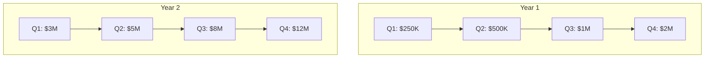

## 11. Investment & Financial Overview

### 11.1 Use of Funds
```typescript
interface FundAllocation {
  development: {
    amount: "$400,000",
    usage: [
      "Core platform development",
      "WebGPU optimization",
      "AI marketplace creation",
      "Security enhancements"
    ]
  },
  operations: {
    amount: "$250,000",
    usage: [
      "Team expansion",
      "Office setup",
      "Legal compliance",
      "Operational costs"
    ]
  },
  marketing: {
    amount: "$200,000",
    usage: [
      "Community building",
      "Brand awareness",
      "Developer outreach",
      "Partnership development"
    ]
  },
  reserve: {
    amount: "$150,000",
    usage: [
      "Emergency fund",
      "Opportunity fund",
      "Market making",
      "Contingency"
    ]
  }
}
```

### 11.2 Financial Projections



### 11.3 Revenue Streams
1. **Compute Fee Revenue**
   ```typescript
   interface RevenueModel {
     computeFees: {
       margin: "30%",
       projectedVolume: "$10M/year",
       netRevenue: "$3M/year"
     },
     marketplaceFees: {
       margin: "5%",
       projectedVolume: "$20M/year",
       netRevenue: "$1M/year"
     },
     enterpriseContracts: {
       margin: "50%",
       projectedDeals: "10 major contracts",
       netRevenue: "$5M/year"
     }
   }
   ```

