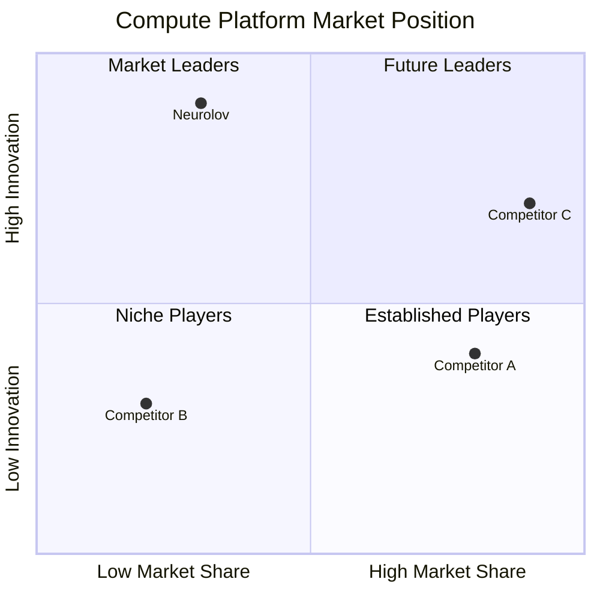
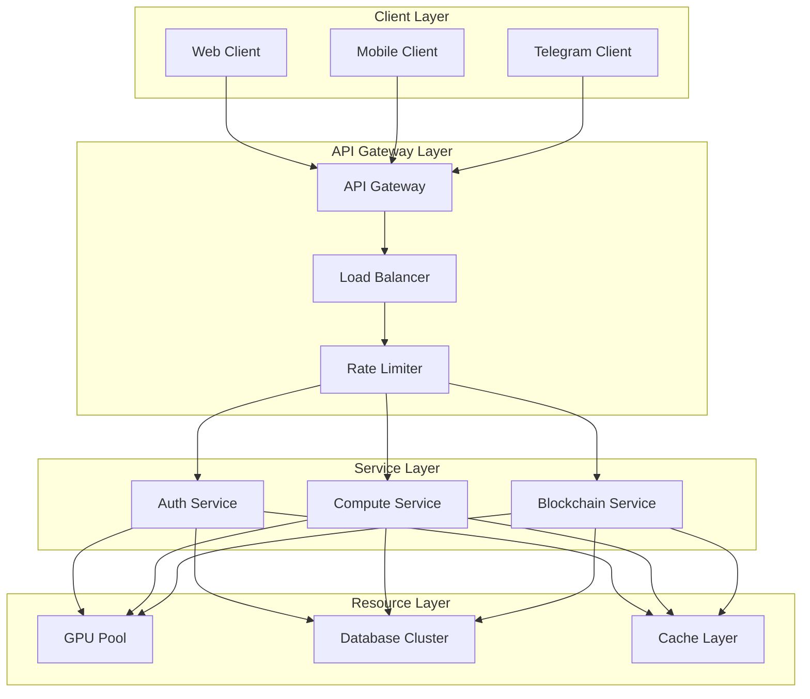

# Neurolov Advanced Technical Specifications
*Technical Implementation Document - 2024*

## 1. Advanced Technical Implementations

### 1.1 WebGPU Compute Pipeline

```typescript
class NeurolovComputeManager {
  private device: GPUDevice;
  private queue: GPUQueue;
  private computePipeline: GPUComputePipeline;
  
  async initialize() {
    if (!navigator.gpu) {
      throw new Error('WebGPU not supported');
    }
    
    const adapter = await navigator.gpu.requestAdapter();
    this.device = await adapter.requestDevice();
    this.queue = this.device.queue;
  }
  
  async createComputePipeline(shaderCode: string) {
    const shaderModule = this.device.createShaderModule({
      code: shaderCode
    });

    this.computePipeline = this.device.createComputePipeline({
      layout: 'auto',
      compute: {
        module: shaderModule,
        entryPoint: 'main',
        constants: {
          WORKGROUP_SIZE: 256
        }
      }
    });
  }
  
  async executeComputation(inputData: Float32Array): Promise<Float32Array> {
    // Create input buffer
    const inputBuffer = this.device.createBuffer({
      size: inputData.byteLength,
      usage: GPUBufferUsage.STORAGE | GPUBufferUsage.COPY_DST,
    });
    
    // Create output buffer
    const outputBuffer = this.device.createBuffer({
      size: inputData.byteLength,
      usage: GPUBufferUsage.STORAGE | GPUBufferUsage.COPY_SRC,
    });
    
    // Write input data
    this.queue.writeBuffer(inputBuffer, 0, inputData);
    
    // Create bind group
    const bindGroup = this.device.createBindGroup({
      layout: this.computePipeline.getBindGroupLayout(0),
      entries: [
        { binding: 0, resource: { buffer: inputBuffer } },
        { binding: 1, resource: { buffer: outputBuffer } }
      ]
    });
    
    // Execute computation
    const commandEncoder = this.device.createCommandEncoder();
    const passEncoder = commandEncoder.beginComputePass();
    passEncoder.setPipeline(this.computePipeline);
    passEncoder.setBindGroup(0, bindGroup);
    passEncoder.dispatchWorkgroups(Math.ceil(inputData.length / 256));
    passEncoder.end();
    
    // Submit command buffer
    this.queue.submit([commandEncoder.finish()]);
    
    // Read results
    const resultBuffer = this.device.createBuffer({
      size: outputBuffer.size,
      usage: GPUBufferUsage.COPY_DST | GPUBufferUsage.MAP_READ
    });
    
    const copyEncoder = this.device.createCommandEncoder();
    copyEncoder.copyBufferToBuffer(outputBuffer, 0, resultBuffer, 0, resultBuffer.size);
    this.queue.submit([copyEncoder.finish()]);
    
    await resultBuffer.mapAsync(GPUMapMode.READ);
    const resultArray = new Float32Array(resultBuffer.getMappedRange());
    resultBuffer.unmap();
    
    return resultArray;
  }
}
```

### 1.2 Distributed Task Scheduler

```typescript
interface TaskDefinition {
  id: string;
  type: 'compute' | 'training' | 'inference';
  requirements: {
    minGPUMemory: number;
    minComputePower: number;
    expectedDuration: number;
  };
  priority: number;
  data: ArrayBuffer;
}

class DistributedTaskScheduler {
  private taskQueue: PriorityQueue<TaskDefinition>;
  private nodeRegistry: Map<string, NodeStatus>;
  private activeTaskMap: Map<string, string>; // taskId -> nodeId
  
  async scheduleTask(task: TaskDefinition): Promise<string> {
    const availableNodes = this.getAvailableNodes(task.requirements);
    const optimalNode = this.selectOptimalNode(availableNodes, task);
    
    if (!optimalNode) {
      this.taskQueue.enqueue(task);
      throw new Error('No suitable nodes available');
    }
    
    return this.assignTaskToNode(task, optimalNode);
  }
  
  private selectOptimalNode(nodes: NodeStatus[], task: TaskDefinition): NodeStatus | null {
    return nodes.reduce((best, current) => {
      const currentScore = this.calculateNodeScore(current, task);
      const bestScore = best ? this.calculateNodeScore(best, task) : -1;
      return currentScore > bestScore ? current : best;
    }, null);
  }
  
  private calculateNodeScore(node: NodeStatus, task: TaskDefinition): number {
    const performanceScore = node.performance / task.requirements.minComputePower;
    const reliabilityScore = node.uptime / node.totalTime;
    const costScore = 1 / node.costPerHour;
    
    return (performanceScore * 0.4) + (reliabilityScore * 0.3) + (costScore * 0.3);
  }
}
```

## 2. Enhanced Competitor Analysis Metrics

### 2.1 Performance Metrics Comparison

```typescript
interface CompetitorMetrics {
  performance: {
    computeCapacity: {
      neurolov: { tflops: 85000, nodes: 170 },
      competitor_a: { tflops: 120000, nodes: 1000 },
      competitor_b: { tflops: 25000, nodes: 50 },
      competitor_c: { tflops: 500000, nodes: 10000 }
    },
    
    networkEfficiency: {
      neurolov: { latency: 50, throughput: 10000 },
      competitor_a: { latency: 100, throughput: 8000 },
      competitor_b: { latency: 200, throughput: 5000 },
      competitor_c: { latency: 30, throughput: 15000 }
    },
    
    resourceUtilization: {
      neurolov: 0.85,
      competitor_a: 0.70,
      competitor_b: 0.60,
      competitor_c: 0.90
    },
    
    costPerOperation: {
      neurolov: 0.30,
      competitor_a: 0.89,
      competitor_b: 0.45,
      competitor_c: 1.20
    }
  }
}
```

### 2.2 Market Position Analysis



## 3. Tokenomics Simulation

### 3.1 Token Emission Schedule

```typescript
interface EmissionSchedule {
  initialSupply: 500_000_000;
  
  distribution: {
    year1: {
      q1: 50_000_000,
      q2: 50_000_000,
      q3: 25_000_000,
      q4: 25_000_000
    },
    year2: {
      q1: 25_000_000,
      q2: 25_000_000,
      q3: 12_500_000,
      q4: 12_500_000
    },
    year3: {
      q1: 12_500_000,
      q2: 12_500_000,
      q3: 6_250_000,
      q4: 6_250_000
    }
  }
}

class TokenomicsSimulator {
  simulateMarketDynamics(
    initialPrice: number,
    emissionRate: number,
    stakingRatio: number,
    burnRate: number
  ): MarketMetrics {
    const circulatingSupply = this.calculateCirculatingSupply(emissionRate);
    const stakedTokens = circulatingSupply * stakingRatio;
    const burnedTokens = this.calculateBurnedTokens(burnRate);
    
    return {
      effectiveSupply: circulatingSupply - stakedTokens - burnedTokens,
      projectedPrice: this.calculatePrice(
        initialPrice,
        circulatingSupply,
        stakedTokens,
        burnedTokens
      ),
      marketCap: this.calculateMarketCap(),
      stakingAPY: this.calculateStakingAPY(stakingRatio)
    };
  }
}
```

### 3.2 Reward Distribution Model

```solidity
contract RewardDistribution {
    struct UserMetrics {
        uint256 computePower;
        uint256 uptimeScore;
        uint256 qualityScore;
    }
    
    mapping(address => UserMetrics) public userMetrics;
    
    function calculateReward(address user) public view returns (uint256) {
        UserMetrics memory metrics = userMetrics[user];
        
        uint256 baseReward = metrics.computePower * BASE_REWARD_RATE;
        uint256 uptimeMultiplier = calculateUptimeMultiplier(metrics.uptimeScore);
        uint256 qualityMultiplier = calculateQualityMultiplier(metrics.qualityScore);
        
        return baseReward * uptimeMultiplier * qualityMultiplier / 1e18;
    }
}
```

## 4. System Architecture Specifications

### 4.1 High-Level Architecture Diagram



### 4.2 Node Communication Protocol

```typescript
interface NodeProtocol {
  // Node registration
  async register(nodeInfo: NodeInfo): Promise<string> {
    const nodeId = await this.generateNodeId(nodeInfo);
    await this.verifyNodeCapabilities(nodeInfo);
    return this.addToNetwork(nodeId, nodeInfo);
  }
  
  // Health checking
  async checkHealth(nodeId: string): Promise<HealthStatus> {
    const metrics = await this.collectNodeMetrics(nodeId);
    return this.evaluateHealth(metrics);
  }
  
  // Task distribution
  async distributeTask(task: ComputeTask): Promise<void> {
    const targetNode = await this.findOptimalNode(task);
    await this.assignTask(task, targetNode);
    this.monitorExecution(task.id);
  }
}

interface NodeInfo {
  hardware: {
    gpu: {
      model: string;
      memory: number;
      compute: number;
    };
    network: {
      bandwidth: number;
      latency: number;
    }
  };
  location: {
    region: string;
    datacenter?: string;
  };
  capabilities: string[];
}
```

