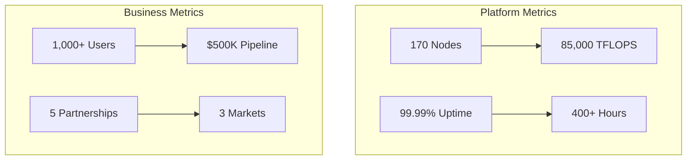
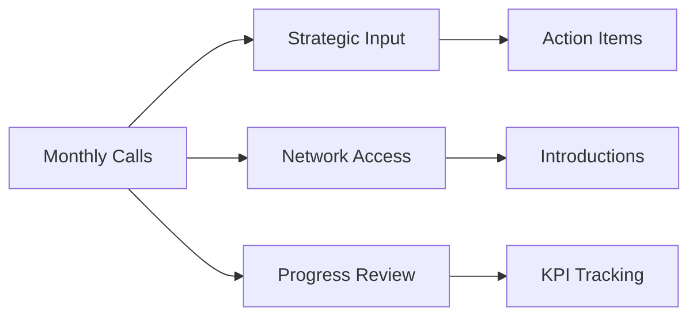
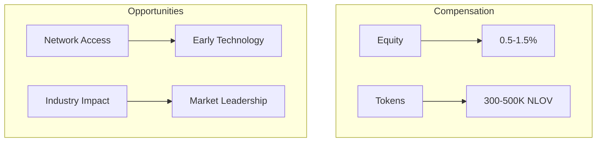
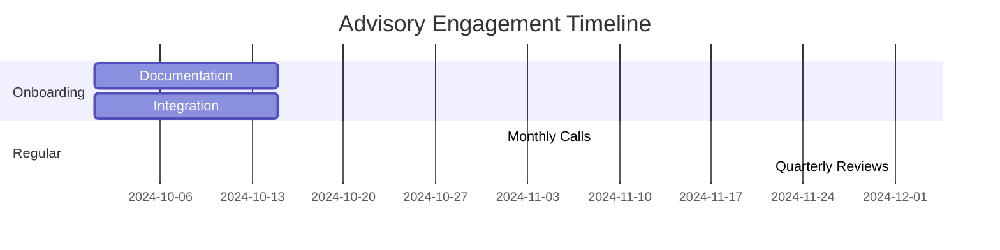

# Neurolov Advisor Proposal Package
*Confidential - Strategic Advisory Opportunity*

## 1. Opportunity Overview

```typescript
interface AdvisoryRole {
  commitment: "4-6 hours/month",
  compensation: {
    equity: "0.5-1.5%",
    tokens: "500,000 NLOV",
    vesting: "24 months linear"
  },
  term: "24 months",
  responsibilities: [
    "Strategic guidance",
    "Network introductions",
    "Technical consultation",
    "Market insights"
  ]
}
```

## 2. Company Status & Traction

### 2.1 Current Metrics


### 2.2 Growth Trajectory
```typescript
interface GrowthMetrics {
  current: {
    nodes: 170,
    compute: "85,000 TFLOPS",
    users: "1,000+"
  },
  sixMonths: {
    nodes: "5,000",
    compute: "250,000 TFLOPS",
    users: "50,000"
  },
  twelveMonths: {
    nodes: "25,000",
    compute: "1,250,000 TFLOPS",
    users: "250,000"
  }
}
```

## 3. Advisory Roles & Responsibilities

### 3.1 Role Categories
```typescript
interface AdvisoryRoles {
  technical: {
    focus: [
      "Architecture review",
      "Scaling strategy",
      "Technology roadmap"
    ],
    compensation: "1.5% equity"
  },
  business: {
    focus: [
      "Growth strategy",
      "Partnership development",
      "Market expansion"
    ],
    compensation: "1.0% equity"
  },
  industry: {
    focus: [
      "Market insights",
      "Industry connections",
      "Strategic positioning"
    ],
    compensation: "0.75% equity"
  }
}
```

### 3.2 Engagement Framework


## 4. Compensation Structure

### 4.1 Equity Component
| Role Type | Equity Range | Vesting Period | Cliff |
|-----------|-------------|----------------|-------|
| Technical | 1.0-1.5% | 24 months | 6 months |
| Business | 0.75-1.0% | 24 months | 6 months |
| Industry | 0.5-0.75% | 24 months | 6 months |

### 4.2 Token Allocation
```typescript
interface TokenCompensation {
  allocation: {
    technical: "500,000 NLOV",
    business: "400,000 NLOV",
    industry: "300,000 NLOV"
  },
  vesting: {
    period: "24 months",
    schedule: "Linear monthly",
    lockup: "6 months post-TGE"
  },
  benefits: {
    staking: "Priority pool",
    governance: "Voting rights",
    network: "Node operator status"
  }
}
```

## 5. Value Proposition

### 5.1 Advisor Benefits


### 5.2 Growth Potential
```typescript
interface GrowthProjections {
  marketSize: "$87.5B by 2027",
  companyGrowth: {
    Y1: "10x",
    Y2: "5x",
    Y3: "3x"
  },
  tokenValue: {
    initial: "$0.10",
    projected: "$1.00-3.00",
    timeline: "24 months"
  }
}
```

## 6. Engagement Process

### 6.1 Onboarding Timeline
```typescript
interface OnboardingProcess {
  steps: [
    {
      phase: "Initial Discussion",
      timeline: "1 week",
      outcome: "Role alignment"
    },
    {
      phase: "Documentation",
      timeline: "1 week",
      outcome: "Agreement signing"
    },
    {
      phase: "Integration",
      timeline: "2 weeks",
      outcome: "Platform access & setup"
    }
  ],
  requirements: [
    "Background check",
    "Conflict disclosure",
    "Confidentiality agreement"
  ]
}
```

### 6.2 Ongoing Engagement


## 7. Next Steps

### 7.1 Expression of Interest
To proceed with the advisory role:
1. Review role specifications
2. Schedule detailed discussion
3. Receive formal agreement
4. Complete onboarding

### 7.2 Contact Information
```typescript
interface Contact {
  email: "advisors@neurolov.com",
  telegram: "@NeurolovAdvisory",
  scheduling: "calendly.com/neurolov-advisory"
}
```

## Legal Disclaimer
[Standard legal disclaimer and confidentiality notice]

Pending:
1. Add more detailed role specifications
2. Include specific KPIs and success metrics
3. Expand the compensation structure
4. Provide advisor agreement template

