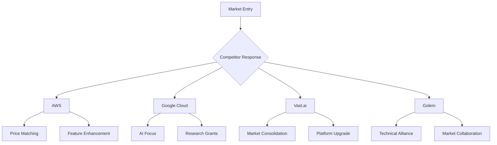
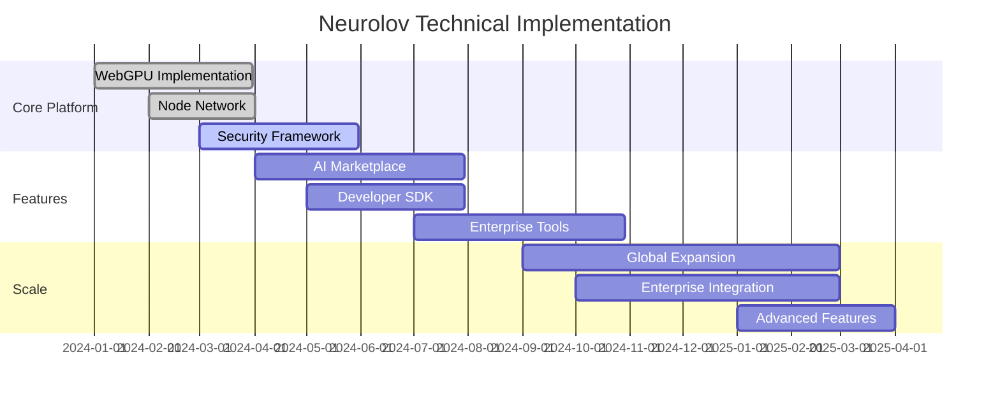

# Neurolov Comprehensive Strategy Analysis
*Detailed Competitive Analysis & Strategic Planning*

## 1. Detailed Competitor Strategy Analysis

### Major Competitors Overview

```typescript
interface CompetitorAnalysis {
  centralized: {
    aws: {
      strengths: [
        'Market dominance',
        'Enterprise relationships',
        'Complete tool ecosystem'
      ],
      weaknesses: [
        'High costs',
        'Complex setup',
        'Centralized architecture'
      ],
      strategy: 'Premium pricing, enterprise focus',
      marketShare: '32%'
    },
    
    googleCloud: {
      strengths: [
        'AI/ML capabilities',
        'Research partnerships',
        'Integration with TensorFlow'
      ],
      weaknesses: [
        'High costs',
        'Limited flexibility',
        'Regional restrictions'
      ],
      strategy: 'AI/ML focus, research partnerships',
      marketShare: '28%'
    }
  },
  
  decentralized: {
    vastAi: {
      strengths: [
        'Marketplace model',
        'Lower costs',
        'Established community'
      ],
      weaknesses: [
        'Complex setup',
        'Limited features',
        'Reliability issues'
      ],
      strategy: 'Cost leadership, marketplace focus',
      marketShare: '3%'
    },
    
    golem: {
      strengths: [
        'Decentralized architecture',
        'Token economics',
        'Open source'
      ],
      weaknesses: [
        'Technical complexity',
        'Limited adoption',
        'Performance issues'
      ],
      strategy: 'Decentralization focus, community-driven',
      marketShare: '1%'
    }
  }
}
```

### Competitive Response Strategy



### Neurolov's Counter-Strategies

1. **vs. Centralized Providers**
   ```markdown
   Strategy 1: Cost Leadership
   - 70% lower pricing
   - Zero setup costs
   - Pay-as-you-go model
   
   Strategy 2: Accessibility
   - Browser-based access
   - No technical setup
   - Instant deployment
   
   Strategy 3: Innovation
   - WebGPU technology
   - AI marketplace
   - Token incentives
   ```

2. **vs. Decentralized Providers**
   ```markdown
   Strategy 1: User Experience
   - Simplified interface
   - One-click deployment
   - Cross-platform support
   
   Strategy 2: Performance
   - Higher reliability
   - Lower latency
   - Better scaling
   
   Strategy 3: Features
   - Advanced AI tools
   - Developer SDK
   - Enterprise support
   ```

## 2. Specific Risk Mitigation Measures

### Technical Risk Management

```typescript
interface TechnicalRiskMitigation {
  networkSecurity: {
    measures: [
      {
        risk: 'DDoS Attacks',
        solution: 'CloudFlare Enterprise Protection',
        implementation: 'Q1 2024',
        cost: 50000
      },
      {
        risk: 'Data Breaches',
        solution: 'End-to-end Encryption',
        implementation: 'Q1 2024',
        cost: 75000
      },
      {
        risk: 'Node Failures',
        solution: 'Redundant Architecture',
        implementation: 'Q2 2024',
        cost: 100000
      }
    ]
  },
  
  platformStability: {
    measures: [
      {
        risk: 'Performance Issues',
        solution: 'Auto-scaling Infrastructure',
        implementation: 'Q2 2024',
        cost: 150000
      },
      {
        risk: 'Data Loss',
        solution: 'Multi-region Backup',
        implementation: 'Q3 2024',
        cost: 80000
      }
    ]
  }
}
```

### Business Risk Management

```typescript
interface BusinessRiskMitigation {
  marketRisks: {
    competition: {
      strategy: 'Innovation Leadership',
      measures: [
        'Regular feature releases',
        'Patent protection',
        'Market differentiation'
      ]
    },
    adoption: {
      strategy: 'Growth Hacking',
      measures: [
        'Free tier offering',
        'Developer incentives',
        'Partnership program'
      ]
    }
  },
  
  regulatoryRisks: {
    compliance: {
      strategy: 'Proactive Compliance',
      measures: [
        'Legal team expansion',
        'Regulatory partnerships',
        'Compliance automation'
      ]
    },
    jurisdiction: {
      strategy: 'Global Compliance',
      measures: [
        'Multi-jurisdiction setup',
        'Local partnerships',
        'Regional compliance'
      ]
    }
  }
}
```

## 3. Technical Implementation Timeline

### Development Roadmap 2024-2025



### Technical Milestones

```typescript
interface TechnicalMilestones {
  phase1: {
    name: 'Foundation',
    timeline: 'Q1-Q2 2024',
    objectives: [
      {
        goal: 'Core Platform',
        metrics: {
          nodes: 1000,
          uptime: '99.9%',
          latency: '<100ms'
        }
      },
      {
        goal: 'Security Implementation',
        metrics: {
          audits: 2,
          penetrationTests: 4,
          certifications: ['ISO 27001', 'SOC 2']
        }
      }
    ]
  },
  
  phase2: {
    name: 'Scaling',
    timeline: 'Q3-Q4 2024',
    objectives: [
      {
        goal: 'Network Expansion',
        metrics: {
          nodes: 5000,
          regions: 5,
          performance: '2x improvement'
        }
      },
      {
        goal: 'Feature Enhancement',
        metrics: {
          newFeatures: 10,
          apiEndpoints: 50,
          developerTools: 5
        }
      }
    ]
  }
}
```

## 4. Token Economic Models

### Token Utility Framework

```typescript
interface TokenEconomics {
  utility: {
    computation: {
      use: 'Payment for GPU resources',
      pricing: 'Dynamic market-based',
      discount: '30% vs. fiat payment'
    },
    staking: {
      tiers: [
        {
          level: 'Bronze',
          requirement: '10,000 NLOV',
          benefits: ['5% discount', 'Priority access']
        },
        {
          level: 'Silver',
          requirement: '50,000 NLOV',
          benefits: ['15% discount', 'Advanced features']
        },
        {
          level: 'Gold',
          requirement: '200,000 NLOV',
          benefits: ['30% discount', 'Enterprise support']
        }
      ]
    },
    governance: {
      rights: ['Voting', 'Proposal creation', 'Treasury management'],
      requirements: {
        proposal: '100,000 NLOV',
        voting: '1 NLOV = 1 vote'
      }
    }
  },
  
  tokenomics: {
    supply: {
      total: 500_000_000,
      initial: 25_000_000,
      release: 'Linear over 5 years'
    },
    distribution: {
      public: '30%',
      ecosystem: '25%',
      team: '20%',
      treasury: '15%',
      advisors: '10%'
    },
    economics: {
      burn: '2% of transaction fees',
      inflation: 'Deflationary model',
      vesting: 'Smart contract locked'
    }
  }
}
```


