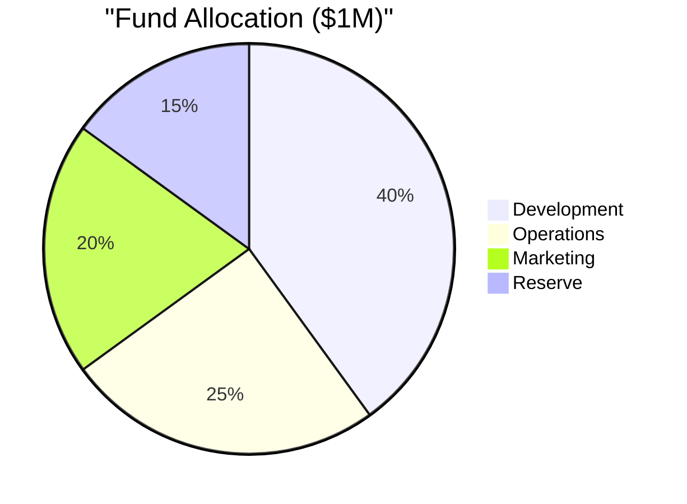
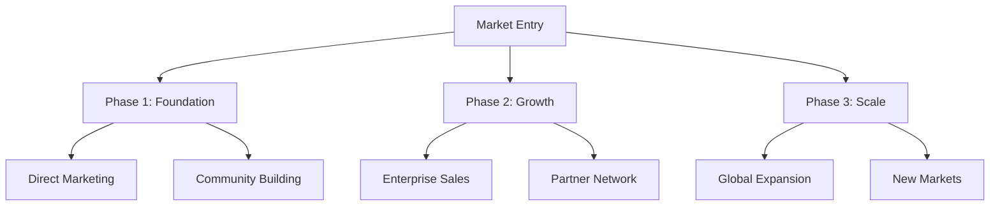
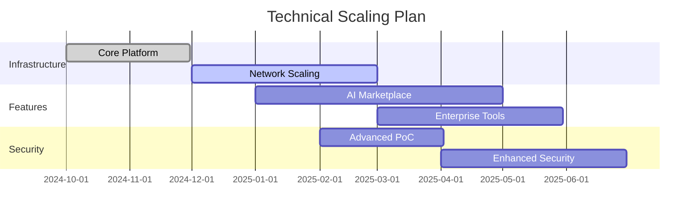
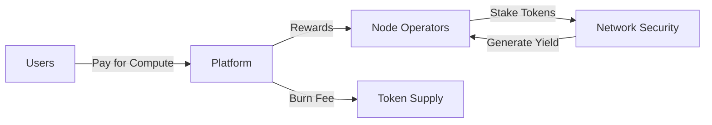

# Neurolov Investment Memorandum
*CONFIDENTIAL - For Qualified Investors Only*

## 1. Investment Overview

### 1.1 Investment Highlights
```typescript
interface InvestmentOpportunity {
  round: {
    size: "$1,000,000",
    type: "SAFE",
    valuation: "$10M cap",
    minimumTicket: "$50,000",
    targetClose: "December 2024"
  },
  currentTraction: {
    nodes: 170,
    compute: "85,000 TFLOPS",
    uptime: "99.99%",
    users: "1,000+ beta",
  },
  projectedMetrics: {
    year1Revenue: "$3.75M",
    year2Revenue: "$21.5M",
    grossMargin: "70%",
    marketShare: "5% by 2025"
  }
}
```

### 1.2 Use of Funds


## 2. Financial Projections & Metrics

### 2.1 Revenue Model
```typescript
interface RevenueStreams {
  computeFees: {
    margin: "70%",
    volume: {
      Y1: "$2.5M",
      Y2: "$15M",
      Y3: "$45M"
    }
  },
  marketplace: {
    margin: "25%",
    volume: {
      Y1: "$1M",
      Y2: "$5M",
      Y3: "$12M"
    }
  },
  enterprise: {
    margin: "80%",
    contracts: {
      Y1: "5 pilots",
      Y2: "20 contracts",
      Y3: "50 contracts"
    }
  }
}
```

### 2.2 Key Performance Indicators
| Metric | Year 1 | Year 2 | Year 3 |
|--------|--------|--------|--------|
| Active Nodes | 5,000 | 25,000 | 100,000 |
| Revenue | $3.75M | $21.5M | $59M |
| Gross Margin | 65% | 70% | 75% |
| User Base | 50K | 250K | 1M |
| TFLOPS | 250K | 1.25M | 5M |

## 3. Market & Growth Strategy

### 3.1 Target Market Segments
```typescript
interface MarketSegments {
  primary: {
    segment: "AI Researchers",
    size: "$39.4B",
    penetration: "2% Y1"
  },
  secondary: {
    segment: "Data Scientists",
    size: "$26.2B",
    penetration: "1.5% Y1"
  },
  tertiary: {
    segment: "Enterprise",
    size: "$21.9B",
    penetration: "0.5% Y1"
  }
}
```

### 3.2 Go-To-Market Strategy


## 4. Technical Infrastructure & Scaling

### 4.1 Technology Stack
```typescript
interface TechnicalArchitecture {
  compute: {
    webGPU: "Browser-based GPU access",
    network: "Distributed node system",
    security: "Multi-layer encryption"
  },
  blockchain: {
    primary: "Solana",
    consensus: "Proof of Computation",
    smart_contracts: "Rust/Anchor"
  },
  infrastructure: {
    deployment: "Kubernetes",
    monitoring: "Grafana + Prometheus",
    security: "CloudFlare + Custom"
  }
}
```

### 4.2 Scaling Roadmap


## 5. Token Economics & Utility

### 5.1 Token Metrics
```typescript
interface TokenMetrics {
  token: {
    name: "NLOV",
    total_supply: 500_000_000,
    initial_price: "$0.10",
    initial_mcap: "$5M"
  },
  distribution: {
    seed: "8%",
    public: "15%",
    team: "16%",
    ecosystem: "25%",
    treasury: "15%",
    reserves: "21%"
  },
  vesting: {
    seed: "12 months linear",
    team: "36 months linear",
    advisors: "24 months linear"
  }
}
```

### 5.2 Token Utility Flow


## 6. Risk Analysis & Mitigation

### 6.1 Risk Matrix
| Risk Category | Probability | Impact | Mitigation Strategy |
|--------------|-------------|---------|-------------------|
| Technical | Medium | High | Multi-layer redundancy |
| Market | Low | Medium | Diverse revenue streams |
| Regulatory | Low | High | Legal compliance framework |
| Competition | Medium | Medium | First-mover advantage + Patents |

### 6.2 Mitigation Strategies
```typescript
interface RiskMitigation {
  technical: [
    "Redundant systems",
    "Regular security audits",
    "Backup infrastructure"
  ],
  market: [
    "Diversified revenue",
    "Strategic partnerships",
    "Market research"
  ],
  regulatory: [
    "Legal advisors",
    "Compliance team",
    "Regular audits"
  ]
}
```

## 7. Investment Terms & Structure

### 7.1 Investment Structure
```typescript
interface InvestmentTerms {
  instrument: "SAFE Note",
  valuation_cap: "$10,000,000",
  discount_rate: "20%",
  minimum_investment: "$50,000",
  investor_rights: [
    "Pro-rata rights",
    "Information rights",
    "Board observer rights (>$200K)"
  ],
  expected_exit: {
    primary: "Strategic acquisition",
    secondary: "Token liquidity",
    timeline: "3-5 years"
  }
}
```

Peding:
1. Detailed financials & projections
2. Team & governance structure
3. Legal & compliance framework
4. Investment process & timeline

