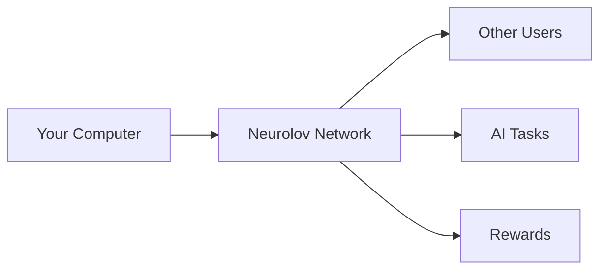
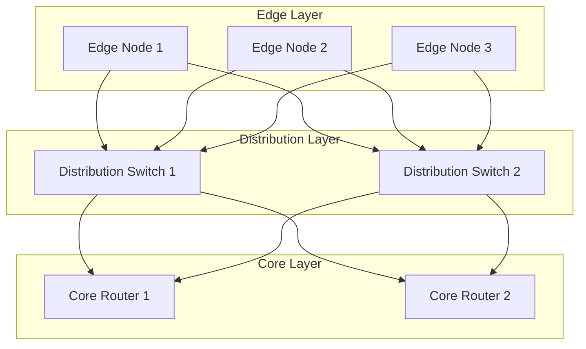

# Neurolov Network Architecture & Performance Optimization
*Technical & Simplified Guide - 2024*

## Part A: For Non-Technical Readers 🌟

### What is Neurolov in Simple Terms?

Think of Neurolov like a massive virtual computer network where:
- People can share their computer's power to help others
- Users can earn rewards for sharing their resources
- Anyone can access powerful computing when they need it
- AI developers can create and share their work

#### 💡 Quick Example:
Imagine you need to edit a complex video but don't have a powerful enough computer. Instead of buying expensive hardware, you can use Neurolov to:
1. Connect to the network
2. Use other people's spare computing power
3. Complete your task quickly
4. Pay only for what you use

### How Does It Work? 

#### 1. The Network


#### 2. Key Benefits
- 💰 Earn money by sharing your computer's power
- 💻 Access powerful computing when needed
- 🤝 Join a community of tech enthusiasts
- 🔒 Safe and secure connections

### Understanding Performance

Think of our network like a highway system:
- More lanes = More traffic capacity
- Smart traffic routing = Faster travel
- Multiple routes = Better reliability

## Part B: Technical Deep Dive 🔧

### 1. Advanced Network Topology

```typescript
interface NetworkTopology {
  nodes: {
    edge: EdgeNode[];
    core: CoreNode[];
    gateway: GatewayNode[];
  };
  
  routing: {
    protocol: 'OSPF' | 'BGP';
    optimization: 'latency' | 'throughput';
    redundancy: number;
  };
  
  meshConfiguration: {
    type: 'full' | 'partial';
    connectionDensity: number;
    replicationFactor: number;
  };
}

class NetworkManager {
  private topology: NetworkTopology;
  
  constructor() {
    this.topology = {
      nodes: {
        edge: [],
        core: [],
        gateway: []
      },
      routing: {
        protocol: 'OSPF',
        optimization: 'latency',
        redundancy: 3
      },
      meshConfiguration: {
        type: 'partial',
        connectionDensity: 0.75,
        replicationFactor: 2
      }
    };
  }
  
  async optimizeNetwork(): Promise<void> {
    const metrics = await this.collectNetworkMetrics();
    const optimalConfig = this.calculateOptimalConfiguration(metrics);
    await this.applyConfiguration(optimalConfig);
  }
  
  private async collectNetworkMetrics(): Promise<NetworkMetrics> {
    // Implementation details
  }
}
```

### 2. Performance Optimization Strategies

#### 2.1 Load Balancing Algorithm

```typescript
class LoadBalancer {
  private nodes: ComputeNode[];
  private activeJobs: Map<string, Job>;
  
  async distributeLoad(job: ComputeJob): Promise<NodeAssignment> {
    const availableNodes = this.getAvailableNodes();
    const nodeScores = this.calculateNodeScores(availableNodes, job);
    const optimalNode = this.selectOptimalNode(nodeScores);
    
    return this.assignJob(job, optimalNode);
  }
  
  private calculateNodeScores(nodes: ComputeNode[], job: ComputeJob): NodeScore[] {
    return nodes.map(node => ({
      nodeId: node.id,
      score: (
        node.performance * 0.4 +
        node.reliability * 0.3 +
        node.availability * 0.3
      ) * this.getLocationFactor(node, job)
    }));
  }
}
```

#### 2.2 Resource Optimization

```typescript
interface ResourceOptimizer {
  memory: {
    allocation: 'dynamic' | 'static';
    caching: {
      strategy: 'LRU' | 'MRU' | 'ARC';
      size: number;
    };
    compression: {
      enabled: boolean;
      algorithm: 'LZ4' | 'ZSTD';
      level: number;
    };
  };
  
  compute: {
    scheduling: 'FIFO' | 'priority' | 'fair';
    batching: {
      enabled: boolean;
      maxSize: number;
      timeout: number;
    };
    prefetching: {
      enabled: boolean;
      strategy: 'predictive' | 'static';
    };
  };
}
```

### 3. Network Optimization Visualizations



### 4. Performance Metrics and Monitoring

```typescript
interface PerformanceMetrics {
  network: {
    latency: {
      p50: number;
      p95: number;
      p99: number;
    };
    throughput: {
      inbound: number;
      outbound: number;
    };
    packetLoss: number;
  };
  
  compute: {
    utilization: number;
    queueLength: number;
    responseTime: number;
    errorRate: number;
  };
  
  memory: {
    used: number;
    available: number;
    swapUsage: number;
    pageRate: number;
  };
}

class MetricsCollector {
  async collectMetrics(): Promise<PerformanceMetrics> {
    const networkMetrics = await this.getNetworkMetrics();
    const computeMetrics = await this.getComputeMetrics();
    const memoryMetrics = await this.getMemoryMetrics();
    
    return {
      network: networkMetrics,
      compute: computeMetrics,
      memory: memoryMetrics
    };
  }
}
```

## For Everyone: Key Takeaways 🎯

### 1. Network Benefits
- Super fast connections worldwide
- Automatic scaling based on demand
- Self-healing network design
- Smart resource distribution

### 2. Performance Improvements
- Tasks complete faster
- Lower costs for users
- Better reliability
- Improved resource usage

### 3. Real-World Impact
- Faster AI model training
- More accessible computing power
- Lower entry barriers for developers
- Sustainable computing practices

## Future Developments 🚀

### For Users
- Mobile app for easy monitoring
- Simplified dashboard
- Automatic optimization
- Better rewards system

### For Developers
- Enhanced API access
- More development tools
- Better testing environments
- Advanced monitoring capabilities

---

Need more details about any specific aspect? Let us know, and we'll provide more information! 

Remember:
- Start small and grow with us
- Join our community for support
- Check our documentation
- Participate in our rewards program
