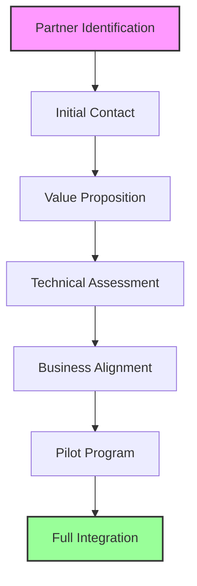

# Neurolov Partnership Development Strategy
*Strategic Alliance & Growth Framework 2024-2025*

## 1. Partnership Categories & Targeting

### Strategic Partner Matrix
```typescript
interface PartnershipMatrix {
  technology: {
    gpu: {
      targets: [
        {
          name: 'NVIDIA',
          priority: 'High',
          value: 'Hardware integration, market access',
          status: 'Initial discussions'
        },
        {
          name: 'AMD',
          priority: 'High',
          value: 'Developer tools, market reach',
          status: 'Proposal stage'
        },
        {
          name: 'Intel',
          priority: 'Medium',
          value: 'Edge computing, IoT integration',
          status: 'Research phase'
        }
      ],
      benefits: [
        'Hardware optimization',
        'Driver support',
        'Marketing channels'
      ]
    },
    
    cloud: {
      targets: [
        {
          name: 'Digital Ocean',
          priority: 'High',
          value: 'Infrastructure, developer community',
          status: 'Advanced discussions'
        },
        {
          name: 'Cloudflare',
          priority: 'High',
          value: 'Edge network, security',
          status: 'Initial contact'
        }
      ],
      benefits: [
        'Infrastructure scaling',
        'Global presence',
        'Technical expertise'
      ]
    },
    
    ai: {
      targets: [
        {
          name: 'Hugging Face',
          priority: 'High',
          value: 'Model marketplace, AI community',
          status: 'Proposal stage'
        },
        {
          name: 'OpenAI',
          priority: 'Medium',
          value: 'AI innovation, research',
          status: 'Research phase'
        }
      ],
      benefits: [
        'AI model integration',
        'Research collaboration',
        'Technical validation'
      ]
    }
  },
  
  business: {
    enterprise: {
      targets: [
        {
          name: 'Fortune 500 Tech Companies',
          priority: 'High',
          value: 'Enterprise adoption, revenue',
          status: 'Multiple discussions'
        },
        {
          name: 'Research Institutions',
          priority: 'Medium',
          value: 'Validation, use cases',
          status: 'Ongoing outreach'
        }
      ],
      benefits: [
        'Revenue generation',
        'Market validation',
        'Use case development'
      ]
    },
    
    financial: {
      targets: [
        {
          name: 'Top 10 Crypto Exchanges',
          priority: 'High',
          value: 'Token liquidity, market access',
          status: 'Advanced discussions'
        },
        {
          name: 'DeFi Protocols',
          priority: 'Medium',
          value: 'Token utility, ecosystem',
          status: 'Initial contacts'
        }
      ],
      benefits: [
        'Market liquidity',
        'Token ecosystem',
        'Trading volume'
      ]
    }
  }
}
```

## 2. Partnership Development Framework

### Engagement Process


### Partnership Lifecycle Management
```typescript
interface PartnershipLifecycle {
  stages: {
    initiation: {
      activities: [
        'Market research',
        'Partner profiling',
        'Value proposition development'
      ],
      timeline: '1-2 months',
      resources: ['BD Team', 'Technical Team']
    },
    
    development: {
      activities: [
        'Technical integration planning',
        'Business model alignment',
        'Legal framework'
      ],
      timeline: '2-3 months',
      resources: ['Legal Team', 'Technical Team', 'Business Team']
    },
    
    implementation: {
      activities: [
        'Technical integration',
        'Market testing',
        'Performance monitoring'
      ],
      timeline: '3-6 months',
      resources: ['Development Team', 'QA Team', 'Operations Team']
    },
    
    growth: {
      activities: [
        'Scale operations',
        'Expand use cases',
        'Deepen integration'
      ],
      timeline: 'Ongoing',
      resources: ['All Teams']
    }
  }
}
```

## 3. Partnership Value Creation

### Value Exchange Framework
```typescript
interface PartnershipValue {
  neurolov: {
    provides: [
      'GPU compute access',
      'Cost reduction',
      'Technology innovation',
      'Market access',
      'Token economics'
    ],
    receives: [
      'Market validation',
      'Technical expertise',
      'Distribution channels',
      'Revenue opportunities',
      'Brand association'
    ]
  },
  
  partners: {
    provides: [
      'Market reach',
      'Technical resources',
      'Customer base',
      'Industry expertise',
      'Infrastructure'
    ],
    receives: [
      'New revenue streams',
      'Technology access',
      'Cost savings',
      'Innovation opportunities',
      'Market differentiation'
    ]
  }
}
```

## 4. Implementation Timeline

### 2024 Partnership Roadmap
```markdown
Q1 2024
- Sign 2 major GPU partnerships
- Establish 3 cloud provider relationships
- Initialize 5 enterprise pilots

Q2 2024
- Launch 3 AI research collaborations
- Onboard 2 major exchanges
- Expand to 10 enterprise clients

Q3 2024
- Scale to 5 GPU partnerships
- Integrate with 5 cloud providers
- Reach 20 enterprise clients

Q4 2024
- Global expansion partnerships
- Strategic M&A opportunities
- Industry consortium leadership
```

## 5. Success Metrics & KPIs

### Partnership Performance Tracking
```typescript
interface PartnershipMetrics {
  performance: {
    business: {
      revenueGeneration: 'Target: $1M per major partner',
      marketExpansion: 'Target: 25% user growth per partner',
      costReduction: 'Target: 15% through partnerships'
    },
    
    technical: {
      integrationSuccess: 'Target: 95% uptime',
      performanceImprovement: 'Target: 30% efficiency gain',
      featureDeployment: 'Target: 5 new features per quarter'
    },
    
    market: {
      brandAwareness: 'Target: 50% recognition in target market',
      userAcquisition: 'Target: 100K users per major partner',
      marketShare: 'Target: 5% market share per region'
    }
  },
  
  evaluation: {
    quarterly: [
      'Revenue contribution',
      'Technical performance',
      'User growth',
      'Cost efficiency',
      'Market impact'
    ],
    annual: [
      'Strategic alignment',
      'Innovation contribution',
      'Market position',
      'Growth trajectory',
      'Partnership ROI'
    ]
  }
}
```

## 6. Risk Management & Mitigation

### Partnership Risk Framework
```typescript
interface PartnershipRisk {
  categories: {
    strategic: [
      'Partner alignment drift',
      'Market strategy conflicts',
      'Competitive tensions'
    ],
    operational: [
      'Integration challenges',
      'Performance issues',
      'Resource constraints'
    ],
    commercial: [
      'Revenue sharing disputes',
      'Market performance',
      'Cost overruns'
    ]
  },
  
  mitigation: {
    strategy: [
      'Regular strategy alignment sessions',
      'Clear governance framework',
      'Flexible partnership terms'
    ],
    operations: [
      'Technical oversight committee',
      'Regular performance reviews',
      'Resource planning'
    ],
    commercial: [
      'Clear commercial terms',
      'Regular financial reviews',
      'Dispute resolution framework'
    ]
  }
}
```

Would you like me to:
1. Expand on any specific partnership category?
2. Provide more detailed implementation plans?
3. Add specific partner case studies?
4. Include more detailed metrics or KPIs?
5. Develop specific partnership proposals?
