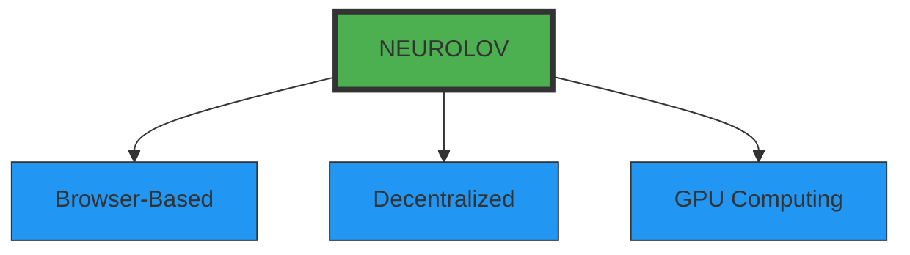
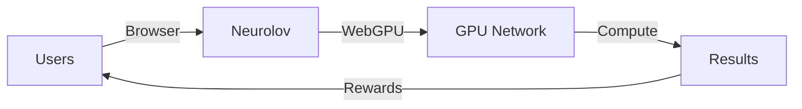
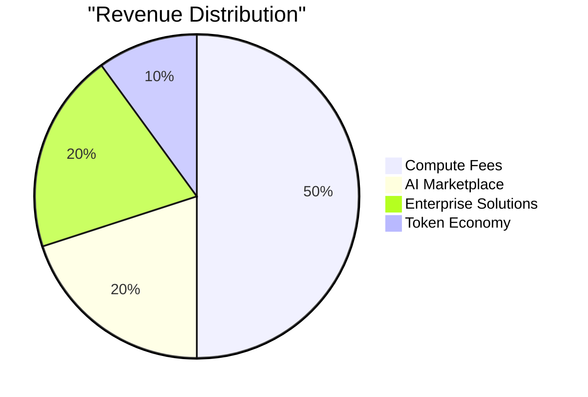

# Neurolov Pitch Deck
*Democratizing GPU Computing Through Browser-Based Technology*

## Slide 1: Title & Vision

*Raising $1M to Democratize GPU Computing*

## Slide 2: Problem
### The GPU Computing Crisis

🔴 **Current Challenges:**
- High-end GPUs cost $2000-10,000
- Cloud GPU costs $2.50-4.00/hour
- Complex setup & deployment
- Limited accessibility


## Slide 3: Solution
### Browser-Based GPU Computing Platform

🟢 **Our Innovation:**


- Instant access through any browser
- No installation required
- Pay-as-you-go model
- Fair reward distribution

## Slide 4: Market Size
### $87.5B Opportunity

- Total Market Size: $87.5B by 2027
- Annual Growth Rate: 32.5% annual growth
  ## Market Segments:
- AI & Machine Learning: 45% - $39.4B
- Scientific Computing: 30% - $26.2B
- Rendering: 25% - $21.9B

## Slide 5: Traction & Validation
### Current Metrics

📈 **Platform Performance:**
- 170 Active GPU Nodes
- 85,000 TFLOPS Computing Power
- 99.99% Uptime
- 400+ Operational Hours
- 78% Resource Utilization

## Slide 6: Technology
### Technical Innovation

```typescript
interface TechStack {
  frontend: {
    webGPU: "Browser-based computing",
    framework: "React + Next.js",
    integration: "Telegram micro-app"
  },
  backend: {
    compute: "Distributed GPU network",
    blockchain: "Solana + Smart Contracts",
    security: "Multi-layer encryption"
  }
}
```

## Slide 7: Business Model
### Revenue Streams & Unit Economics



- Average Cost/Hour: $0.30 (vs. $2.50 competitors)
- Gross Margin: 70%
- Customer CAC: $30
- Customer LTV: $300

## Slide 8: Competition
### Competitive Advantage Matrix

| Feature | Neurolov | Cloud Providers | Other Decentralized |
|---------|----------|-----------------|-------------------|
| Access Method | Browser | API/Console | Software |
| Setup Time | Minutes | Hours/Days | Days |
| Cost/Hour | $0.30 | $2.50 | $0.80 |
| Token Economics | ✓ | ✗ | Partial |

## Slide 9: Team
[Placeholder: Add team headshots and brief bios]

**Leadership:**
- CEO: [Name] - Ex-Google AI, Stanford PhD
- CTO: [Name] - Ex-NVIDIA, MIT
- Head of Engineering: [Name] - Ex-AWS
- Chief Scientist: [Name] - PhD Distributed Systems

## Slide 10: Roadmap
### Execution Timeline

```mermaid
    title 2024-2025 Milestones
    dateFormat YYYY-Q1
    section Platform
    Beta Launch      :done, 2024-Q1, 90d
    Mainnet         :active, 2024-Q2, 90d
    section Growth
    Token Sale      :2024-Q3, 60d
    Exchange Listing :2024-Q4, 60d
```

## Slide 11: Investment
### $1M Seed Round

```typescript
interface FundUse {
  development: {
    amount: "$400K",
    focus: [
      "Core platform enhancement",
      "AI marketplace development",
      "Security implementation"
    ]
  },
  operations: {
    amount: "$250K",
    focus: [
      "Team expansion",
      "Infrastructure scaling",
      "Legal & compliance"
    ]
  },
  marketing: {
    amount: "$200K",
    focus: [
      "User acquisition",
      "Community building",
      "Partnership development"
    ]
  },
  reserve: {
    amount: "$150K",
    focus: [
      "Working capital",
      "Emergency fund",
      "Opportunities"
    ]
  }
}
```

## Slide 12: Thank You
### Contact Information

[Company Logo]

**Contact Us:**
- Website: www.neurolov.com
- Email: investors@neurolov.com
- Telegram: @NeurolovOfficial

[Add QR code for immediate access to data room]

