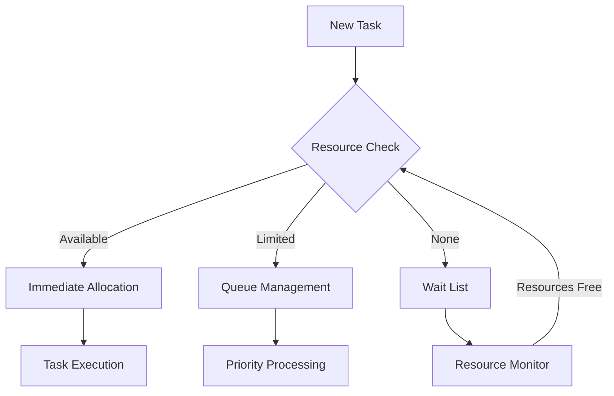

# Neurolov Resource Management & Monitoring Guide
*Comprehensive Guide for Users and Developers - 2024*

## 1. Resource Allocation Strategies 🎯

### For Regular Users
Resource allocation is like managing a smart power grid:
- Your tasks get the right amount of power when needed
- Resources are shared efficiently among users
- Costs are optimized automatically
- Priority is given to time-sensitive tasks

### For Technical Users

```typescript
class ResourceAllocator {
  async allocateResources(task: ComputeTask): Promise<AllocationResult> {
    const requirements = this.analyzeTaskRequirements(task);
    const availableResources = await this.getAvailableResources();
    
    return this.optimizeAllocation(requirements, availableResources);
  }
  
  private analyzeTaskRequirements(task: ComputeTask): Requirements {
    return {
      gpuMemory: this.calculateMemoryNeeds(task),
      computePower: this.estimateComputePower(task),
      duration: this.predictDuration(task),
      priority: this.determinePriority(task)
    };
  }
}

interface AllocationStrategy {
  type: 'immediate' | 'batch' | 'priority';
  constraints: {
    maxGPUMemory: number;
    maxDuration: number;
    costLimit: number;
  };
  optimization: {
    target: 'performance' | 'cost' | 'balanced';
    weights: {
      speed: number;
      efficiency: number;
      reliability: number;
    };
  };
}
```

### Smart Resource Allocation Visualization



## 2. User-Friendly Monitoring Tools 📊

### Basic Monitoring Dashboard
Simple metrics everyone can understand:

```typescript
interface UserDashboard {
  // Simple metrics
  basic: {
    activeJobs: number;
    totalCost: number;
    estimatedCompletion: Date;
    resourceUsage: percentage;
  };
  
  // Performance indicators
  performance: {
    speed: 'Low' | 'Medium' | 'High';
    efficiency: 'Poor' | 'Good' | 'Excellent';
    status: 'Active' | 'Queued' | 'Complete';
  };
}
```

### Advanced Monitoring Features

```typescript
class MonitoringSystem {
  private metrics: SystemMetrics;
  private alerts: AlertSystem;
  
  async trackResources(): Promise<ResourceStatus> {
    const currentStatus = await this.collectMetrics();
    const analysis = this.analyzeMetrics(currentStatus);
    
    if (analysis.needsAttention) {
      this.triggerAlert(analysis.issues);
    }
    
    return this.formatStatusReport(analysis);
  }
}
```

### Real-Time Dashboard Components

```typescript
interface DashboardComponents {
  charts: {
    resourceUsage: LineChart;
    costTracking: BarChart;
    performanceMetrics: GaugeChart;
  };
  
  alerts: {
    type: 'warning' | 'error' | 'info';
    message: string;
    timestamp: Date;
    action?: () => void;
  }[];
  
  controls: {
    pauseTask: () => void;
    adjustResources: (amount: number) => void;
    optimizePerformance: () => void;
  };
}
```

### User-Friendly Visualization Example

```react
const ResourceMonitor = () => {
  return (
    <Card className="p-6 mx-auto max-w-4xl">
      <CardHeader>
        <div className="flex justify-between items-center">
          <h2 className="text-2xl font-bold">Resource Monitor</h2>
          <StatusBadge status={currentStatus} />
        </div>
      </CardHeader>
      <CardContent>
        <div className="grid grid-cols-3 gap-4">
          <MetricCard
            title="GPU Usage"
            value={gpuUsage}
            icon={<Cpu />}
          />
          <MetricCard
            title="Active Tasks"
            value={activeTasks}
            icon={<Activity />}
          />
          <MetricCard
            title="Cost/Hour"
            value={costPerHour}
            icon={<DollarSign />}
          />
        </div>
        <div className="mt-6">
          <UsageChart data={usageHistory} />
        </div>
      </CardContent>
    </Card>
  );
};
```

## 3. Performance Benchmarking Methods 📈

### Easy Benchmarking Tools

For regular users:
1. Quick Performance Check
   - Task completion time
   - Cost efficiency
   - Resource usage

2. Comparison Tools
   - Your performance vs. average
   - Cost benchmarks
   - Efficiency scores

### Technical Benchmarking System

```typescript
interface BenchmarkSuite {
  tests: {
    compute: ComputeBenchmark[];
    memory: MemoryBenchmark[];
    network: NetworkBenchmark[];
  };
  
  metrics: {
    throughput: number;
    latency: number;
    efficiency: number;
    costPerOperation: number;
  };
  
  comparison: {
    historical: MetricHistory;
    peer: PeerComparison;
    optimal: OptimalMetrics;
  };
}

class BenchmarkRunner {
  async runBenchmark(type: BenchmarkType): Promise<BenchmarkResult> {
    const startTime = performance.now();
    const results = await this.executeTests(type);
    const duration = performance.now() - startTime;
    
    return {
      scores: this.calculateScores(results),
      metrics: this.analyzePerformance(results, duration),
      recommendations: this.generateRecommendations(results)
    };
  }
}
```

### Performance Visualization

```typescript
interface PerformanceVisualization {
  charts: {
    historical: {
      type: 'line';
      data: TimeSeriesData[];
      metrics: string[];
    };
    comparison: {
      type: 'radar';
      categories: string[];
      values: number[];
    };
    distribution: {
      type: 'histogram';
      bins: number;
      data: number[];
    };
  };
}
```

### Benchmark Results Display

```react
const BenchmarkResults = () => {
  return (
    <div className="benchmark-container">
      <div className="score-overview">
        <ScoreCard 
          title="Overall Performance"
          score={overallScore}
          trend={trend}
        />
        <MetricGrid metrics={detailedMetrics} />
      </div>
      
      <div className="charts-section">
        <PerformanceChart data={performanceData} />
        <ComparisonChart data={comparisonData} />
      </div>
      
      <div className="recommendations">
        <RecommendationList items={recommendations} />
      </div>
    </div>
  );
};
```

## Best Practices & Tips 💡

### For Users
1. Regular Monitoring
   - Check dashboard daily
   - Set up alerts for important metrics
   - Review cost reports weekly

2. Resource Optimization
   - Use auto-scaling features
   - Schedule intensive tasks during off-peak hours
   - Monitor cost efficiency

3. Performance Improvement
   - Regular benchmark runs
   - Compare with similar users
   - Implement recommended optimizations

### For Developers
1. Resource Management
   - Implement efficient batching
   - Use predictive scaling
   - Optimize resource release

2. Monitoring Integration
   - Use provided APIs
   - Implement custom metrics
   - Set up automated alerts

3. Benchmark Integration
   - Regular performance tests
   - Automated reporting
   - Continuous optimization

---

Pending:
1. Custom monitoring setups?
2. Advanced benchmarking scenarios?
3. Resource optimization strategies?
4. Integration examples?

