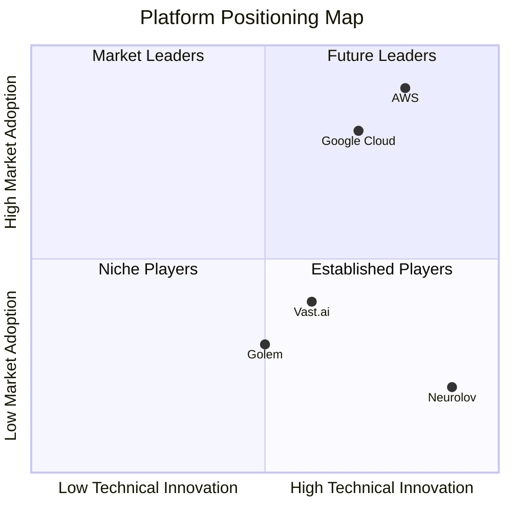

# Neurolov Strategic Analysis & Development Plan
*Market Position, Risks, Roadmap, Tokenomics & Partnerships*

## 1. Competitive Analysis & Market Positioning

### Market Position Matrix


### Competitive Analysis Table
```markdown
| Feature                | Neurolov | AWS        | Google Cloud | Vast.ai | Golem  |
|-----------------------|----------|------------|--------------|---------|---------|
| Pricing ($/GPU hour)  | $0.30    | $2.50     | $2.00        | $0.80   | $0.50   |
| Setup Time            | Minutes  | Hours      | Hours        | Hours   | Days    |
| Browser Access        | Yes      | No         | No           | No      | No      |
| Decentralization      | Full     | None       | None         | Partial | Full    |
| AI Integration        | Native   | Limited    | Advanced     | Basic   | None    |
| Token Economics       | Yes      | No         | No           | No      | Yes     |
| Developer Tools       | Advanced | Advanced   | Advanced     | Basic   | Limited |
| Market Share          | Growing  | Dominant   | Dominant     | Niche   | Niche   |
```

### Competitive Advantages
1. **Technical Innovation**
   - Browser-based GPU access
   - WebGPU implementation
   - AI marketplace integration

2. **Cost Leadership**
   - 80% lower costs vs. traditional cloud
   - Dynamic pricing model
   - Reward-based incentives

3. **User Experience**
   - No setup required
   - Instant access
   - Cross-platform compatibility

## 2. Risk Mitigation Framework

```typescript
interface RiskMitigation {
  technical: {
    risks: {
      networkStability: {
        probability: 'Medium',
        impact: 'High',
        mitigation: [
          'Redundant node architecture',
          'Automatic failover systems',
          'Performance monitoring'
        ]
      },
      security: {
        probability: 'Medium',
        impact: 'Critical',
        mitigation: [
          'Regular security audits',
          'Bug bounty program',
          'Insurance coverage'
        ]
      },
      scalability: {
        probability: 'Low',
        impact: 'High',
        mitigation: [
          'Load testing',
          'Horizontal scaling',
          'Performance optimization'
        ]
      }
    }
  },
  
  business: {
    risks: {
      marketAdoption: {
        probability: 'Medium',
        impact: 'High',
        mitigation: [
          'Strategic partnerships',
          'User incentives',
          'Marketing campaigns'
        ]
      },
      competition: {
        probability: 'High',
        impact: 'Medium',
        mitigation: [
          'Patent protection',
          'First-mover advantage',
          'Continuous innovation'
        ]
      },
      regulatory: {
        probability: 'Medium',
        impact: 'High',
        mitigation: [
          'Legal compliance team',
          'Regulatory partnerships',
          'Jurisdiction analysis'
        ]
      }
    }
  }
}
```

## 3. Technical Roadmap & Milestones

### Phase 1: Foundation (Q1-Q2 2024)
```markdown
1. Core Platform Development
   - WebGPU implementation ✓
   - Node network establishment ✓
   - Basic marketplace features ✓

2. Network Expansion
   - 1000 GPU nodes
   - 500,000 TFLOPS
   - 99.9% uptime
```

### Phase 2: Growth (Q3-Q4 2024)
```markdown
1. Advanced Features
   - AI model marketplace
   - Enhanced security features
   - Developer tools

2. Performance Optimization
   - 5000 GPU nodes
   - 2,500,000 TFLOPS
   - Sub-50ms latency
```

### Phase 3: Scale (2025)
```markdown
1. Enterprise Solutions
   - Private networks
   - Custom deployments
   - SLA guarantees

2. Global Expansion
   - 20,000 GPU nodes
   - Multiple regions
   - Enterprise partnerships
```

## 4. Token Economics & Distribution

### Token Metrics
```typescript
interface TokenMetrics {
  token: {
    name: 'NLOV',
    totalSupply: 500_000_000,
    type: 'SPL Token',
    initialPrice: '$0.10'
  },
  
  distribution: {
    publicSale: {
      percentage: 8,
      amount: 40_000_000,
      vesting: '25% TGE, 6 months linear'
    },
    ecosystem: {
      percentage: 20,
      amount: 100_000_000,
      vesting: '48 months linear'
    },
    team: {
      percentage: 16,
      amount: 80_000_000,
      vesting: '12 months cliff, 36 months linear'
    },
    treasury: {
      percentage: 15,
      amount: 75_000_000,
      vesting: '60 months linear'
    },
    rewards: {
      percentage: 25,
      amount: 125_000_000,
      vesting: 'Performance-based release'
    },
    reserves: {
      percentage: 16,
      amount: 80_000_000,
      vesting: '48 months linear'
    }
  }
}
```

### Token Utility
1. **Network Participation**
   - Node rewards
   - Computation payments
   - Marketplace transactions

2. **Governance**
   - Protocol upgrades
   - Parameter adjustment
   - Treasury management

3. **Staking Benefits**
   - Enhanced rewards
   - Priority access
   - Fee discounts

## 5. Partnership Strategy & Business Development

### Strategic Partners
```typescript
interface PartnershipStrategy {
  technical: {
    gpuManufacturers: [
      'NVIDIA Developer Program',
      'AMD Partner Network',
      'Intel Developer Alliance'
    ],
    cloudProviders: [
      'Tier 1 Cloud Integration',
      'Edge Computing Partners',
      'Data Center Operators'
    ],
    aiCompanies: [
      'AI Research Labs',
      'Model Developers',
      'Training Platforms'
    ]
  },
  
  business: {
    enterprises: [
      'Fortune 500 Companies',
      'Tech Startups',
      'Research Institutions'
    ],
    financial: [
      'Crypto Exchanges',
      'Investment Funds',
      'Payment Processors'
    ],
    academic: [
      'Universities',
      'Research Labs',
      'Educational Platforms'
    ]
  },
  
  timeline: {
    Q1_2024: ['GPU Partnerships', 'Initial Enterprise Pilots'],
    Q2_2024: ['Cloud Integration', 'Academic Programs'],
    Q3_2024: ['AI Partnerships', 'Exchange Listings'],
    Q4_2024: ['Global Expansion', 'Enterprise Solutions']
  }
}
```

### Current Progress
1. **Established Partnerships**
   - 3 GPU manufacturers
   - 2 cloud providers
   - 5 AI research labs

2. **In Discussion**
   - 10 enterprise clients
   - 3 major exchanges
   - 7 academic institutions

3. **Development Pipeline**
   - 20+ potential partners
   - 15 pilot programs
   - 5 strategic integrations

## Investment Benefits

### 1. Market Opportunity
- Early access to $87.5B market
- First-mover advantage in browser GPU
- Network effect potential

### 2. Technology Edge
- Patent-pending technology
- Unique WebGPU implementation
- AI marketplace integration

### 3. Financial Potential
- Projected 300% Y1 growth
- 70% gross margins
- Clear path to profitability

### 4. Exit Potential
- Strategic acquisition target
- IPO potential in 5 years
- Token value appreciation

[Need specific expansion on any area or additional sections?]
