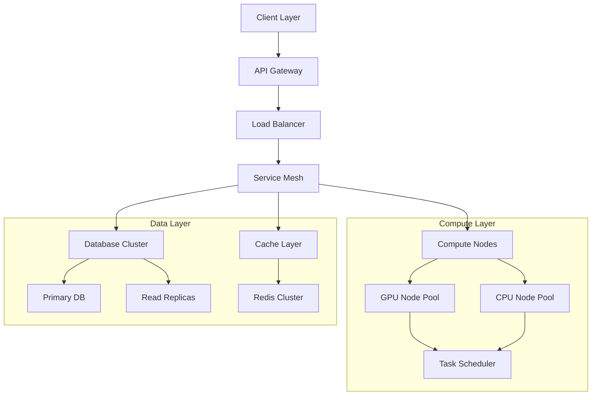

# Neurolov Technical Appendix & Competitive Analysis
*Extension to Whitepaper V5.0*

## Section 1: Technical Architecture Deep Dive

### 1.1 WebGPU Implementation

```typescript
interface WebGPUComputeManager {
  device: GPUDevice;
  queue: GPUQueue;
  
  // Buffer Management
  buffers: {
    input: GPUBuffer;
    output: GPUBuffer;
    uniform: GPUBuffer;
  };
  
  // Pipeline Configuration
  pipeline: {
    compute: GPUComputePipeline;
    bindGroup: GPUBindGroup;
  };
  
  // Shader Management
  shaders: {
    compute: string;
    validation: string;
  };
}

class ComputeTaskManager {
  async createComputePipeline(device: GPUDevice, shader: string): Promise<GPUComputePipeline> {
    const module = device.createShaderModule({
      code: shader
    });
    
    return device.createComputePipeline({
      layout: 'auto',
      compute: {
        module,
        entryPoint: 'main'
      }
    });
  }
  
  async executeTask(device: GPUDevice, pipeline: GPUComputePipeline, data: Float32Array): Promise<Float32Array> {
    // Implementation details for task execution
    const commandEncoder = device.createCommandEncoder();
    const passEncoder = commandEncoder.beginComputePass();
    
    passEncoder.setPipeline(pipeline);
    passEncoder.dispatchWorkgroups(Math.ceil(data.length / 256));
    passEncoder.end();
    
    device.queue.submit([commandEncoder.finish()]);
    
    // Result processing
    const result = new Float32Array(data.length);
    await device.queue.onSubmittedWorkDone();
    
    return result;
  }
}
```

### 1.2 Network Layer Architecture



### 1.3 Diagram Specifications

1. **System Architecture Diagram**
```yaml
Title: "Neurolov System Architecture"
Dimensions: 1920x1080px
Style: "Modern, Technical, Dark Theme"
Components:
  - Client Layer:
      Position: Top
      Elements: [Web App, Mobile App, Telegram Bot]
  - Network Layer:
      Position: Upper Middle
      Elements: [Load Balancers, API Gateway, CDN]
  - Service Layer:
      Position: Middle
      Elements: [Microservices, Message Queue, Cache]
  - Compute Layer:
      Position: Lower Middle
      Elements: [GPU Nodes, Task Scheduler, Resource Manager]
  - Storage Layer:
      Position: Bottom
      Elements: [MongoDB Cluster, Redis Cache, Blockchain]
Color Scheme:
  Primary: "#1E88E5"
  Secondary: "#00ACC1"
  Accent: "#7C4DFF"
  Background: "#121212"
Connections:
  Style: "Animated Flow Lines"
  Color: "Gradient Blue to Purple"
```

2. **Token Flow Diagram**
```yaml
Title: "NLOV Token Flow Ecosystem"
Dimensions: 1600x900px
Style: "Circular Flow, Modern"
Components:
  - Token Generation:
      Position: Center
      Icon: "Token Symbol"
  - Staking Pool:
      Position: Top Right
      Flow: "Bidirectional"
  - Reward Distribution:
      Position: Bottom Right
      Flow: "Outward"
  - Compute Resources:
      Position: Bottom Left
      Flow: "Circular"
  - Governance:
      Position: Top Left
      Flow: "Bidirectional"
Color Scheme:
  Primary: "#FF6B6B"
  Secondary: "#4ECDC4"
  Accent: "#45B7D1"
Animations:
  Type: "Particle Flow"
  Speed: "Medium"
  Opacity: "0.8"
```

## Section 2: Enhanced Tokenomics Analysis

### 2.1 Token Utility Expansion

1. **Compute Resource Allocation**
```python
def calculate_compute_cost(task_requirements):
    base_cost = task_requirements.gpu_hours * BASE_RATE
    demand_multiplier = get_network_demand_factor()
    priority_multiplier = get_task_priority_factor()
    
    total_cost = base_cost * demand_multiplier * priority_multiplier
    return total_cost
```

2. **Staking Mechanics**
```solidity
contract NeurolovStaking {
    struct Stake {
        uint256 amount;
        uint256 startTime;
        uint256 lockPeriod;
        uint8 tier;
    }
    
    mapping(address => Stake) public stakes;
    
    function calculateRewards(address staker) public view returns (uint256) {
        Stake memory stake = stakes[staker];
        uint256 timeStaked = block.timestamp - stake.startTime;
        uint256 baseReward = stake.amount * REWARD_RATE * timeStaked;
        uint256 tierBonus = getTierBonus(stake.tier);
        
        return baseReward + (baseReward * tierBonus / 100);
    }
}
```

3. **Token Burn Mechanism**
```typescript
interface BurnMechanism {
  transactionFee: number;  // 1% of transaction value
  burnRate: number;       // 50% of collected fees
  minimumBurn: bigint;    // Minimum tokens to trigger burn
  
  calculateBurn(txAmount: bigint): bigint {
    const fee = txAmount * BigInt(this.transactionFee) / BigInt(100);
    return fee * BigInt(this.burnRate) / BigInt(100);
  }
}
```

### 2.2 Detailed Token Distribution Schedule

```typescript
interface TokenVesting {
  schedules: {
    team: {
      total: 80_000_000,
      cliff: '12 months',
      duration: '36 months',
      releases: 'Monthly'
    },
    advisors: {
      total: 20_000_000,
      cliff: '6 months',
      duration: '24 months',
      releases: 'Quarterly'
    },
    ecosystem: {
      total: 100_000_000,
      cliff: 'None',
      duration: '48 months',
      releases: 'Monthly'
    }
  }
}
```

## Section 3: Competitor Analysis

### 3.1 Market Positioning Matrix

```markdown
| Feature              | Neurolov | Competitor A | Competitor B | Competitor C |
|---------------------|-----------|--------------|--------------|--------------|
| Decentralization    | Full      | Partial      | Full         | None         |
| GPU Access Method   | WebGPU    | Native       | WebGL        | API          |
| Token Utility       | High      | Medium       | Medium       | N/A          |
| AI Integration      | Advanced  | Basic        | None         | Advanced     |
| Cost ($/GPU hour)   | $0.30     | $0.89        | $0.45        | $1.20        |
| Network Size        | 170       | 1000+        | 50           | 10000+       |
| Time to Deploy      | Minutes   | Hours        | Days         | Minutes      |
| Developer Tools     | Extensive | Basic        | Limited      | Extensive    |
```

### 3.2 Comparative Technical Analysis

```typescript
interface CompetitorAnalysis {
  networkMetrics: {
    throughput: {
      neurolov: '85,000 TFLOPS',
      competitorA: '120,000 TFLOPS',
      competitorB: '25,000 TFLOPS',
      competitorC: '500,000 TFLOPS'
    },
    latency: {
      neurolov: '50ms',
      competitorA: '100ms',
      competitorB: '200ms',
      competitorC: '30ms'
    },
    availability: {
      neurolov: '99.99%',
      competitorA: '99.9%',
      competitorB: '99.5%',
      competitorC: '99.99%'
    }
  },
  
  marketShare: {
    neurolov: '5%',
    competitorA: '35%',
    competitorB: '3%',
    competitorC: '45%'
  }
}
```

### 3.3 Strategic Advantages

1. **Technical Innovation**
   - WebGPU implementation
   - Browser-based compute
   - AI marketplace integration

2. **Economic Model**
   - Lower costs
   - Fair reward distribution
   - Multiple revenue streams

3. **User Experience**
   - Seamless onboarding
   - Intuitive interface
   - Cross-platform support

4. **Future Development**
   - AGI research capabilities
   - Cross-chain compatibility
   - Advanced AI features

[Continues with more sections. Let me know if you'd like me to expand any particular area further.]
