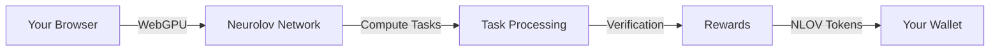

# Neurolov: Complete Guide to Network Participation & Integration
*User Guide & Technical Manual - 2024*

## Part 1: For Regular Users - Earning with Neurolov 🚀

### How to Start Earning NLOV Tokens

1. **Quick Start Guide**
```markdown
Step 1: Visit app.neurolov.com
Step 2: Connect with your browser (Chrome/Edge/Safari)
Step 3: Click "Start Contributing"
Step 4: Set your earning preferences
Step 5: Begin earning NLOV tokens
```

### Understanding the Process 💡



### Earning Potential Calculator
```javascript
// Simple example of how rewards are calculated
const calculateRewards = (computePower, timeContributed) => {
  const baseRate = 0.1; // NLOV per hour
  const powerMultiplier = computePower / 100;
  const timeInHours = timeContributed / 3600;
  
  return baseRate * powerMultiplier * timeInHours;
};
```

### User Dashboard Example
```typescript
interface UserDashboard {
  earnings: {
    daily: number;
    weekly: number;
    total: number;
  };
  performance: {
    computePower: number;
    activeTime: number;
    efficiency: number;
  };
  rewards: {
    pending: number;
    available: number;
    history: Transaction[];
  };
}
```

## Part 2: Framework Integration 🛠️

### 1. React Integration

```typescript
// Neurolov React Hook
import { useNeurolov } from '@neurolov/react';

const MyComponent = () => {
  const { 
    connect, 
    startComputing, 
    pauseComputing, 
    earnings, 
    status 
  } = useNeurolov();

  return (
    <div className="neurolov-container">
      <div className="status-panel">
        <h2>Network Status: {status}</h2>
        <p>Current Earnings: {earnings.current} NLOV</p>
      </div>
      
      <div className="control-panel">
        <button onClick={startComputing}>
          Start Contributing
        </button>
        <button onClick={pauseComputing}>
          Pause
        </button>
      </div>
    </div>
  );
};
```

### 2. Vue.js Integration

```typescript
// Neurolov Vue Composition API
import { useNeurolov } from '@neurolov/vue';

export default {
  setup() {
    const { 
      connection, 
      computeStatus, 
      startMining, 
      stopMining 
    } = useNeurolov();

    return {
      status: computeStatus,
      startContributing: startMining,
      stopContributing: stopMining
    };
  }
};
```

### 3. Angular Integration

```typescript
// Neurolov Angular Service
@Injectable({
  providedIn: 'root'
})
export class NeurolovService {
  private webGPUManager: WebGPUManager;
  
  constructor() {
    this.webGPUManager = new WebGPUManager();
  }
  
  async initializeComputing(): Promise<void> {
    const adapter = await navigator.gpu?.requestAdapter();
    const device = await adapter?.requestDevice();
    
    if (device) {
      await this.webGPUManager.initialize(device);
      this.startComputeTasks();
    }
  }
}
```

## Part 3: Optimization Techniques 🎯

### 1. Compute Optimization

```typescript
class ComputeOptimizer {
  private device: GPUDevice;
  private queue: GPUQueue;
  
  async optimizeWorkload(task: ComputeTask): Promise<void> {
    // Dynamic workgroup size optimization
    const workgroupSize = this.calculateOptimalWorkgroupSize(task);
    
    // Pipeline optimization
    const pipeline = await this.createOptimizedPipeline(workgroupSize);
    
    // Batch processing
    const batchedData = this.batchDataForProcessing(task.data);
    
    // Execute optimized computation
    await this.executeComputation(pipeline, batchedData);
  }
  
  private calculateOptimalWorkgroupSize(task: ComputeTask): number {
    const maxWorkgroupSize = this.device.limits.maxComputeWorkgroupSizeX;
    return Math.min(
      maxWorkgroupSize,
      Math.ceil(task.dataSize / 32) * 32
    );
  }
}
```

### 2. Memory Management

```typescript
class MemoryManager {
  private buffers: Map<string, GPUBuffer>;
  private totalAllocated: number = 0;
  
  async allocateBuffer(
    size: number,
    usage: GPUBufferUsageFlags
  ): Promise<GPUBuffer> {
    // Implement buffer pooling
    const existingBuffer = this.findAvailableBuffer(size);
    if (existingBuffer) return existingBuffer;
    
    // Create new buffer with optimal alignment
    const alignedSize = this.getAlignedSize(size);
    const buffer = this.device.createBuffer({
      size: alignedSize,
      usage,
      mappedAtCreation: false
    });
    
    this.buffers.set(buffer.toString(), buffer);
    this.totalAllocated += alignedSize;
    
    return buffer;
  }
}
```

### 3. WebGPU Performance Optimization

```typescript
class WebGPUOptimizer {
  async optimizeShaderExecution(
    shader: string,
    input: Float32Array
  ): Promise<Float32Array> {
    // Create optimal bind group layout
    const bindGroupLayout = this.device.createBindGroupLayout({
      entries: [
        {
          binding: 0,
          visibility: GPUShaderStage.COMPUTE,
          buffer: { type: 'storage' }
        }
      ]
    });
    
    // Optimize compute pipeline
    const pipeline = await this.createOptimizedPipeline(
      shader,
      bindGroupLayout
    );
    
    // Execute with optimal workgroup configuration
    return this.executeOptimizedCompute(pipeline, input);
  }
}
```

## Part 4: Earning Rewards 💰

### How Rewards Are Calculated

```typescript
interface RewardCalculation {
  baseRate: number;  // Base NLOV per hour
  factors: {
    computePower: number;  // User's GPU power
    uptime: number;      // Availability percentage
    quality: number;     // Task completion quality
  };
  bonuses: {
    streak: number;      // Consecutive days bonus
    volume: number;      // High volume bonus
    referral: number;    // Referral bonus
  };
}

class RewardSystem {
  calculateRewards(metrics: UserMetrics): number {
    const baseReward = this.calculateBaseReward(metrics);
    const bonuses = this.calculateBonuses(metrics);
    const multiplier = this.getRewardMultiplier(metrics);
    
    return (baseReward + bonuses) * multiplier;
  }
}
```

### User Reward Dashboard

```react
const RewardDashboard = () => {
  return (
    <div className="reward-dashboard">
      <div className="earnings-overview">
        <h2>Your Earnings</h2>
        <div className="stats-grid">
          <StatCard
            title="Today's Earnings"
            value={todayEarnings}
            trend={trend}
          />
          <StatCard
            title="Total Earned"
            value={totalEarnings}
            badge={rank}
          />
          <StatCard
            title="Pending Rewards"
            value={pendingRewards}
            eta={nextPayout}
          />
        </div>
      </div>
      
      <div className="performance-metrics">
        <PerformanceChart data={performanceData} />
        <RewardHistory history={rewardHistory} />
      </div>
    </div>
  );
};
```

## Security & Privacy 🔒

1. **Data Protection**
   - End-to-end encryption
   - Sandboxed execution
   - Private computation

2. **Safe Computing**
   - Resource limits
   - Temperature monitoring
   - Automatic throttling

3. **Secure Rewards**
   - Verified computations
   - Transparent earnings
   - Protected withdrawals

## Best Practices 📚

### For Users
1. Keep your browser updated
2. Use a dedicated GPU if possible
3. Monitor your earnings regularly
4. Join the community for tips

### For Developers
1. Implement proper error handling
2. Use the provided optimization tools
3. Regular performance monitoring
4. Follow security guidelines

Need more information about:
1. Advanced optimization techniques?
2. Custom integration scenarios?
3. Specific framework implementations?
4. Reward calculation details?

Let us know and we'll provide more detailed documentation!
