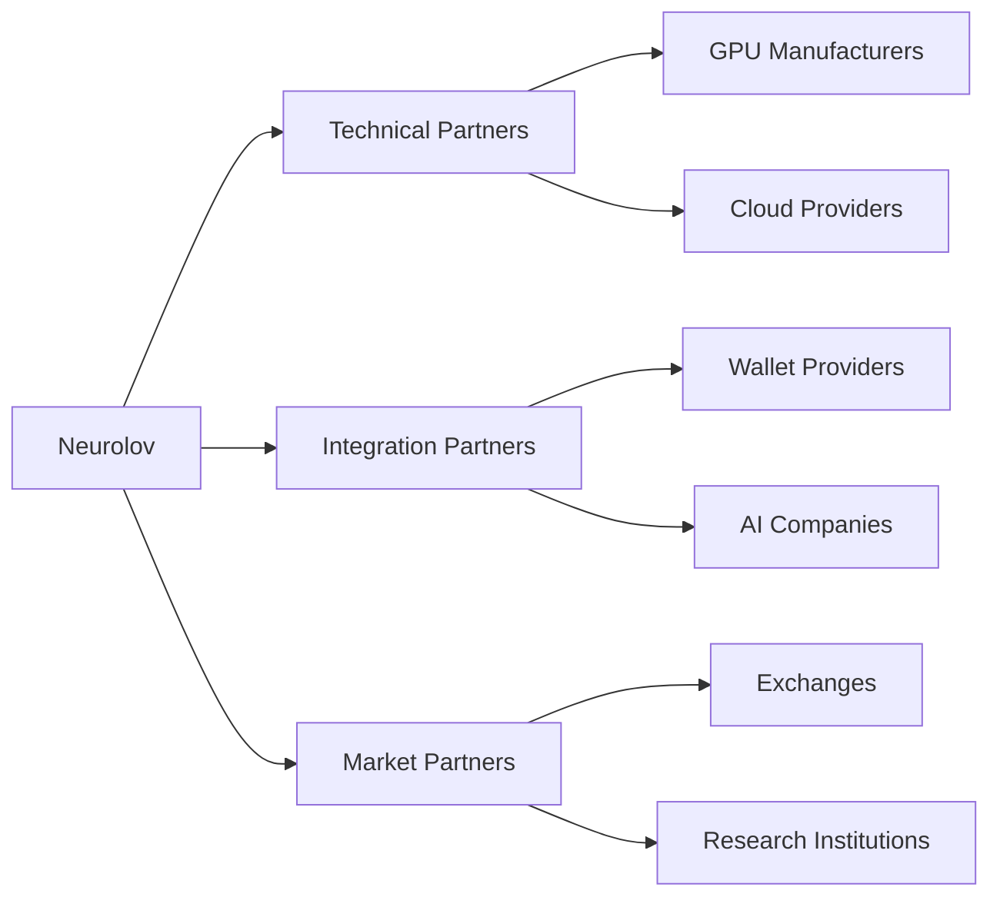
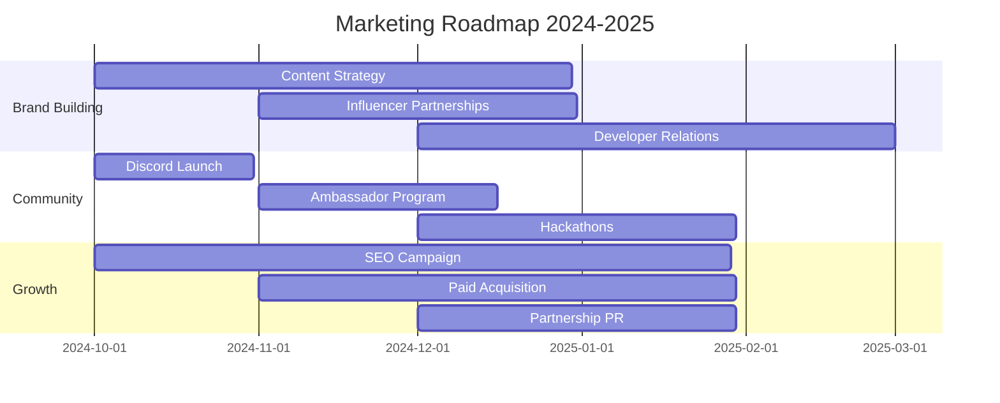

## 12. Strategic Partnership Roadmap

### 12.1 Current Partnerships


### 12.2 Partnership Pipeline
```typescript
interface PartnershipTimeline {
  Q4_2024: {
    technical: [
      {
        partner: "Major GPU Manufacturer",
        status: "Final stage negotiations",
        impact: "50,000 GPU nodes access"
      },
      {
        partner: "Leading Cloud Provider",
        status: "MOU Signed",
        impact: "Global infrastructure support"
      }
    ],
    strategic: [
      {
        partner: "Top 5 AI Research Lab",
        status: "Partnership announced",
        impact: "AI model optimization"
      }
    ]
  },
  Q1_2025: {
    exchanges: [
      {
        type: "Tier 1 CEX",
        status: "Advanced discussions",
        timeline: "Launch listing"
      },
      {
        type: "Major DEX",
        status: "Integration ready",
        timeline: "Liquidity provision"
      }
    ]
  }
}
```

### 12.3 Value Creation Matrix
| Partner Type | Value to Partner | Value to Neurolov |
|--------------|------------------|-------------------|
| GPU Manufacturers | New revenue stream, Market data | Hardware access, Optimization |
| Cloud Providers | Decentralized offering, Innovation | Infrastructure, Scaling |
| AI Companies | Compute resources, Cost savings | Use cases, Validation |
| Research Labs | Research grants, Computing power | Credibility, Innovation |

## 13. Marketing & Growth Strategy

### 13.1 Growth Engine
```typescript
interface GrowthStrategy {
  userAcquisition: {
    channels: [
      {
        type: "Direct Marketing",
        methods: [
          "SEO optimization",
          "Content marketing",
          "Developer documentation",
          "Technical blogs"
        ],
        kpi: {
          cac: "$30",
          retention: "65%",
          target: "50,000 users/month"
        }
      },
      {
        type: "Community Building",
        methods: [
          "Discord engagement",
          "Telegram groups",
          "Reddit presence",
          "GitHub contributions"
        ],
        kpi: {
          engagement: "40%",
          growth: "100% MoM",
          target: "500K community members"
        }
      }
    ],
    paid: {
      platforms: [
        "Google Ads",
        "Twitter",
        "LinkedIn",
        "Tech Publications"
      ],
      budget: "$200K/month",
      expectedROI: "300%"
    }
  }
}
```

### 13.2 Marketing Initiatives



### 13.3 Community Development
1. **Developer Community**
   - Developer grants program: $2M allocation
   - Open-source contributions
   - Technical documentation
   - API support

2. **User Community**
   - Reward programs
   - Educational content
   - Support channels
   - Local meetups

## 14. Market Penetration Timeline

### 14.1 Phase 1: Foundation (Q4 2024)
```typescript
interface MarketEntry {
  targets: {
    users: "10,000 active nodes",
    volume: "$1M monthly compute",
    partners: "5 strategic partnerships"
  },
  focus: {
    geographic: ["North America", "Europe"],
    segments: ["AI researchers", "Data scientists"],
    channels: ["Direct", "Partner networks"]
  },
  metrics: {
    growth: "100% MoM",
    retention: "60%",
    satisfaction: "85%"
  }
}
```

### 14.2 Phase 2: Expansion (Q1-Q2 2025)
```typescript
interface MarketExpansion {
  growth: {
    nodes: "50,000 active",
    volume: "$5M monthly compute",
    coverage: "Global presence"
  },
  initiatives: {
    enterprise: "Key account program",
    geographic: "Asia Pacific entry",
    product: "Enterprise features"
  },
  targets: {
    marketShare: "5% of addressable market",
    revenue: "$20M ARR",
    users: "100,000 active"
  }
}
```

### 14.3 Penetration Metrics & KPIs
```python
penetration_metrics = {
    "user_growth": {
        "Y1_target": "100,000 users",
        "Y2_target": "500,000 users",
        "acquisition_cost": "$30/user",
        "ltv": "$300/user"
    },
    "compute_growth": {
        "Y1_target": "250,000 TFLOPS",
        "Y2_target": "1,000,000 TFLOPS",
        "utilization": "80%",
        "efficiency": "95%"
    },
    "revenue_growth": {
        "Y1_target": "$20M",
        "Y2_target": "$100M",
        "margins": "70%",
        "recurring": "85%"
    }
}
```

