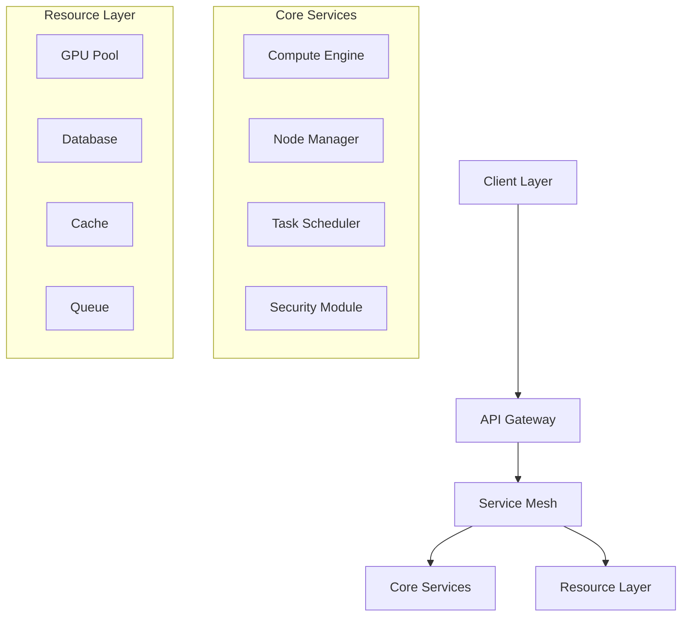
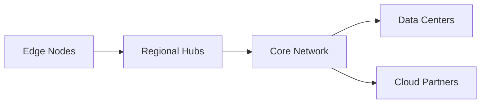
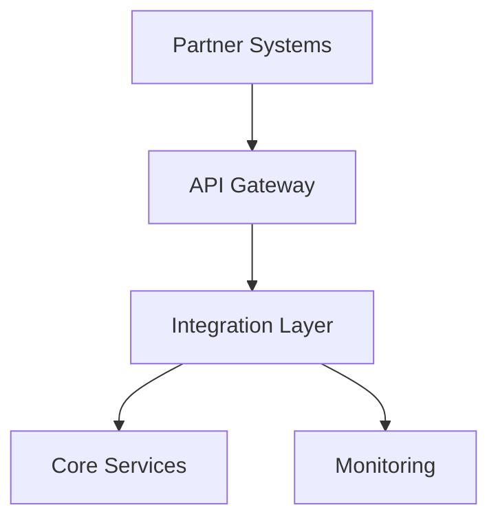
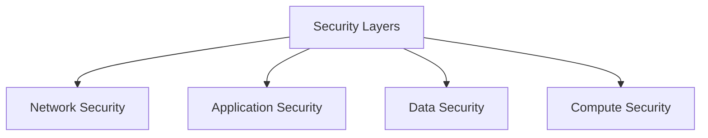

# Neurolov: Technical Architecture Overview
*For Technical Partners & Development Teams*

### Slide 1: System Architecture

### Slide 2: Technical USPs

1. **Browser-Native Computing**
   - WebGPU Implementation
   - Zero Installation
   - Cross-Platform Support
   - Real-Time Processing

2. **Decentralized Architecture**
   - Distributed Node Network
   - Proof of Computation
   - Automatic Failover
   - Load Balancing

3. **Security Framework**
   - End-to-End Encryption
   - Secure Enclaves
   - Zero-Knowledge Proofs
   - Multi-Layer Authentication

### Slide 3: Network Topology

### Slide 4: Performance Metrics

1. **Current Benchmarks**
   - 85,000 TFLOPS Computing Power
   - 50ms Average Latency
   - 99.99% Uptime
   - 170 Active Nodes

2. **Target Metrics 2024**
   - 500,000 TFLOPS
   - 25ms Latency
   - 99.999% Uptime
   - 5,000 Nodes

### Slide 5: Integration Architecture

### Slide 6: Technical Roadmap 2024-2025

**Phase 1: Foundation (Q1-Q2 2024)**
- WebGPU Optimization
- Node Network Expansion
- Security Hardening
- API Enhancement

**Phase 2: Scale (Q3-Q4 2024)**
- Advanced Load Balancing
- Multi-Region Support
- Enterprise Features
- Advanced Monitoring

**Phase 3: Innovation (Q1-Q2 2025)**
- AI Model Marketplace
- Advanced Compute Features
- Cross-Chain Integration
- Custom Solutions

### Slide 7: Technical Partnership Framework

1. **Infrastructure Partners**
   - GPU Manufacturers
   - Cloud Providers
   - Data Centers
   - Network Providers

2. **Technology Partners**
   - AI Companies
   - Security Firms
   - Blockchain Platforms
   - Development Tools

### Slide 8: Development Stack

1. **Frontend Layer**
   - Modern Web Framework
   - WebGPU Integration
   - Real-Time Processing
   - Progressive Web App

2. **Backend Layer**
   - Microservices Architecture
   - Event-Driven Design
   - Distributed Computing
   - High-Performance Stack

### Slide 9: Security Architecture

### Slide 10: Scalability Design

1. **Horizontal Scaling**
   - Node Auto-Discovery
   - Dynamic Resource Allocation
   - Load Distribution
   - Fault Tolerance

2. **Vertical Optimization**
   - Resource Optimization
   - Performance Tuning
   - Caching Strategies
   - Query Optimization

### Slide 11: Integration Capabilities

1. **API Integration**
   - RESTful APIs
   - GraphQL Support
   - WebSocket Connections
   - SDK Access

2. **Custom Solutions**
   - Enterprise Integration
   - Custom Workflows
   - Dedicated Resources
   - Private Networks

### Slide 12: Future Technology Vision

1. **Near Term (6-12 Months)**
   - Enhanced GPU Utilization
   - Advanced Security Features
   - Performance Optimization
   - Tool Integration

2. **Medium Term (12-24 Months)**
   - Quantum Computing Support
   - Advanced AI Integration
   - Cross-Chain Features
   - Custom Silicon Support

3. **Long Term (24+ Months)**
   - AGI Infrastructure
   - Quantum-Resistant Security
   - Advanced Neural Networks
   - Global Computing Grid

### Slide 13: Technical Requirements

1. **Partner Requirements**
   - GPU Compatibility
   - Network Infrastructure
   - Security Standards
   - API Integration

2. **System Requirements**
   - Processing Power
   - Network Bandwidth
   - Storage Capacity
   - Security Compliance

### Slide 14: Discussion Points

1. **Technical Challenges**
   - Scalability Solutions
   - Security Measures
   - Performance Optimization
   - Integration Methods

2. **Partnership Opportunities**
   - Technical Integration
   - Resource Sharing
   - Joint Development
   - Research Collaboration

