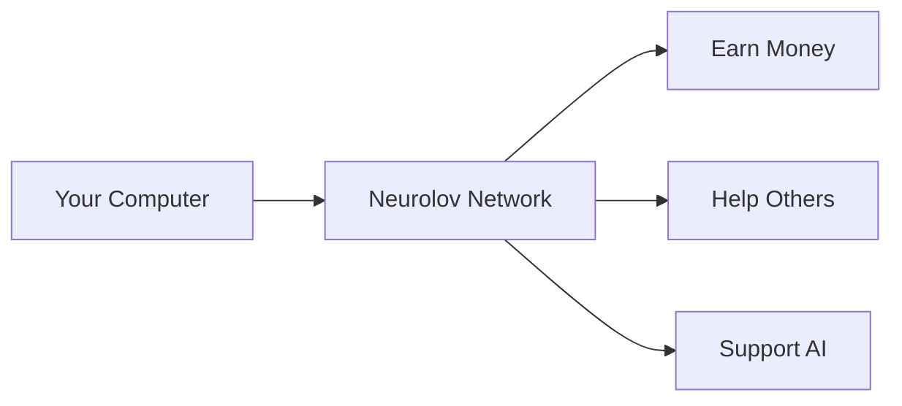

# Neurolov: The Future of Computing
*A Simple Guide to What We Do*

### Slide 1: What is Neurolov?
```markdown
🌟 Imagine if...
- You could rent a supercomputer through your web browser
- Anyone could earn money by sharing their computer's power
- AI developers could access powerful computers at low cost
- All of this could happen with just a few clicks

That's what Neurolov does! 
```

### Slide 2: The Problem We're Solving
```markdown
Today's Challenges:

1. 💻 Powerful computers are EXPENSIVE
   - Can cost $10,000+ to buy
   - Not everyone can afford them

2. 🏢 Big companies control computing power
   - High prices
   - Complex to use
   - Limited access

3. 🤔 Unused computers everywhere
   - Most computers sit idle
   - Wasted resources
   - Lost opportunity
```

### Slide 3: Our Simple Solution


### Slide 4: How It Works
```markdown
Three Simple Steps:

1. 🌐 Connect
   - Just open your web browser
   - No downloads needed
   - No technical knowledge required

2. 💪 Share
   - Share your computer's power
   - Help others who need it
   - Secure and safe

3. 💰 Earn
   - Get paid for sharing
   - Earn special tokens
   - Help build the future
```

### Slide 5: Who Benefits?
```markdown
👨‍💻 Regular People
- Earn money from their computers
- Easy to use
- No technical skills needed

🎮 Gamers with Good PCs
- Make money when not gaming
- Use existing equipment
- Automatic and simple

🔬 Researchers
- Affordable computing power
- Easy access
- Pay only for what they use

🏢 Companies
- Reduce computing costs
- Simple to start
- Flexible usage
```

### Slide 6: Why It's Special
```markdown
✨ Our Advantages:

1. Super Easy
   - Works in your browser
   - No installations
   - Click and start

2. Safe & Secure
   - Like online banking
   - Protected connections
   - Regular security checks

3. Fair & Transparent
   - Clear pricing
   - Honest earnings
   - No hidden fees
```

### Slide 7: The Market Opportunity
```markdown
💡 Big Numbers Made Simple:

The market for computing power is HUGE:
- Like having 100 Amazons worth of opportunity
- Growing faster than smartphones did
- Everyone needs computing power today

Think of it like:
- Airbnb for computers
- Uber for computing power
- YouTube for AI resources
```

### Slide 8: How You Can Make Money
```markdown
💰 Three Ways to Earn:

1. Share Your Computer
   - Like renting out a spare room
   - Automatic payments
   - Work while you sleep

2. Hold Our Tokens
   - Like having shares in a company
   - Value can grow over time
   - Extra benefits for holders

3. Join Our Community
   - Help others
   - Earn rewards
   - Build the future
```

### Slide 9: Real Examples
```markdown
Meet Sarah:
- Regular laptop user
- Earns $100/month sharing power
- Zero technical knowledge

Meet Tom:
- Gamer with good PC
- Makes $300/month when not gaming
- Automatic and easy

Meet Lisa:
- AI researcher
- Saves 70% on computing costs
- Gets work done faster
```

### Slide 10: Getting Started
```markdown
🚀 Join in 3 Easy Steps:

1. Visit our Website
   - www.neurolov.com
   - Click "Start Earning"

2. Connect Your Computer
   - Just one click
   - No downloads
   - Instant setup

3. Start Earning
   - Automatic payments
   - Track earnings live
   - Withdraw anytime
```

### Slide 11: Safety First
```markdown
🔒 Your Safety Matters:

We protect you with:
- Bank-level security
- Safe power limits
- Automatic monitoring
- Full transparency

It's like having a:
- Security guard
- Safety inspector
- Bank vault
All in one!
```

### Slide 12: Future Vision
```markdown
🌟 What's Next:

2024:
- More earning opportunities
- Mobile app launch
- Bigger rewards

2025:
- Global expansion
- New features
- More ways to earn

Join us in building the future of computing!
```

### Slide 13: Common Questions
```markdown
❓ Frequently Asked Questions:

"Is it safe for my computer?"
✅ Yes! We limit power use and have safety controls

"Do I need to be technical?"
✅ No! If you can use Facebook, you can use Neurolov

"When do I get paid?"
✅ Weekly payments, just like a part-time job

"Can I stop anytime?"
✅ Yes! You're in control
```

### Slide 14: Join Us Today
```markdown
🌟 Be Part of Something Big:

Start Today:
1. Visit www.neurolov.com
2. Click "Join Now"
3. Start earning

Questions?
- Email: help@neurolov.com
- Chat: Live support on website
- Call: 24/7 helpline
```

Pedning:
1. Add more real-world examples?
2. Include more visuals?

