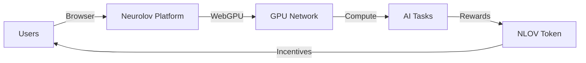
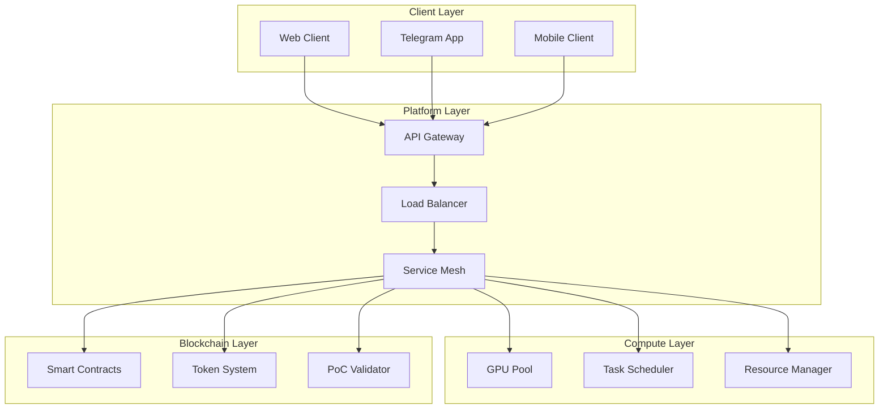

# Neurolov Whitepaper v1.0
*Democratizing AI Compute Through Decentralized Browser-Based GPU Networks*

## Abstract

Neurolov presents a revolutionary decentralized computing ecosystem that democratizes access to GPU resources through browser-based technology. By seamlessly integrating WebGPU, blockchain, and advanced resource allocation algorithms, we enable anyone to participate in and benefit from distributed computing. Our platform has successfully demonstrated this vision with 170 nodes delivering 85,000 TFLOPS of computing power, while maintaining 99.99% uptime across 400+ operational hours.

## 1. Executive Summary

The exponential growth of AI and computational needs has created a critical bottleneck in accessing GPU resources. Neurolov solves this through a first-of-its-kind browser-based GPU marketplace that enables seamless resource sharing while ensuring fair compensation for providers.

### 1.1 Key Innovation Points
```typescript
interface InnovationHighlights {
  technical: {
    webGPU: "Browser-based GPU access without installation",
    network: "Decentralized node architecture with auto-discovery",
    security: "Multi-layer encryption with proof-of-computation"
  },
  business: {
    access: "Zero barrier to entry for users and providers",
    cost: "70% lower than traditional cloud providers",
    reward: "Fair, transparent compensation system"
  }
}
```

### 1.2 Current Platform Metrics
- Active GPU Nodes: 170
- Computing Power: 85,000 TFLOPS
- Network Uptime: 99.99%
- Resource Utilization: 78%
- Average Response Time: 50ms



## 2. Market Analysis & Opportunity

### 2.1 Market Size & Growth
The global GPU cloud computing market is projected to reach:
$$Market_{2027} = \$87.5B * (1 + 0.325)^3 = \$203.7B$$

### 2.2 Current Market Challenges
```typescript
interface MarketChallenges {
  access: {
    hardware: "High upfront costs",
    deployment: "Complex setup requirements",
    availability: "Limited geographic access"
  },
  efficiency: {
    utilization: "Low resource utilization (~30%)",
    cost: "High operational overhead",
    scaling: "Limited flexibility"
  }
}
```

### 2.3 Competitive Analysis
| Feature | Neurolov | Traditional Cloud | Other Decentralized |
|---------|----------|------------------|-------------------|
| Setup Time | Minutes | Hours/Days | Days |
| Cost/Hour | $0.30 | $2.50 | $0.80 |
| Access Method | Browser | API | Software |
| Decentralization | Full | None | Partial |
| Token Economics | Yes | No | Some |

## 3. Technical Architecture

### 3.1 Core System Components



### 3.2 WebGPU Implementation

```typescript
class WebGPUManager {
  private device: GPUDevice;
  private queue: GPUQueue;
  
  async initialize(): Promise<void> {
    if (!navigator.gpu) {
      throw new Error('WebGPU not supported');
    }
    
    const adapter = await navigator.gpu.requestAdapter();
    this.device = await adapter.requestDevice();
    this.queue = this.device.queue;
  }

  async executeComputation(shader: string, input: Float32Array): Promise<Float32Array> {
    const pipeline = await this.createComputePipeline(shader);
    const { inputBuffer, outputBuffer } = await this.createBuffers(input);
    
    const commandEncoder = this.device.createCommandEncoder();
    const passEncoder = commandEncoder.beginComputePass();
    
    passEncoder.setPipeline(pipeline);
    passEncoder.dispatchWorkgroups(Math.ceil(input.length / 256));
    passEncoder.end();
    
    this.queue.submit([commandEncoder.finish()]);
    
    return this.readBuffer(outputBuffer);
  }
}
```

### 3.3 Resource Allocation Algorithm

The platform employs a sophisticated resource allocation system that optimizes for both performance and cost:

$$Score_{node} = 0.4P + 0.3R + 0.3C$$

Where:
- P = Performance metric (0-1)
- R = Reliability score (0-1)
- C = Cost efficiency (0-1)

### 3.4 Proof of Computation (PoC)

```solidity
contract ProofOfComputation {
    struct Task {
        bytes32 id;
        uint256 complexity;
        uint256 deadline;
        address assignedNode;
        bool verified;
    }
    
    mapping(bytes32 => Task) public tasks;
    
    function submitProof(
        bytes32 taskId,
        bytes32 resultHash,
        bytes memory proof
    ) external {
        Task storage task = tasks[taskId];
        require(msg.sender == task.assignedNode, "Invalid node");
        require(block.timestamp <= task.deadline, "Task expired");
        
        if (verifyComputation(taskId, resultHash, proof)) {
            distributeReward(msg.sender, task.complexity);
            task.verified = true;
        }
    }
}
```

