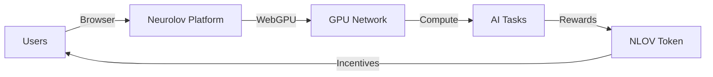
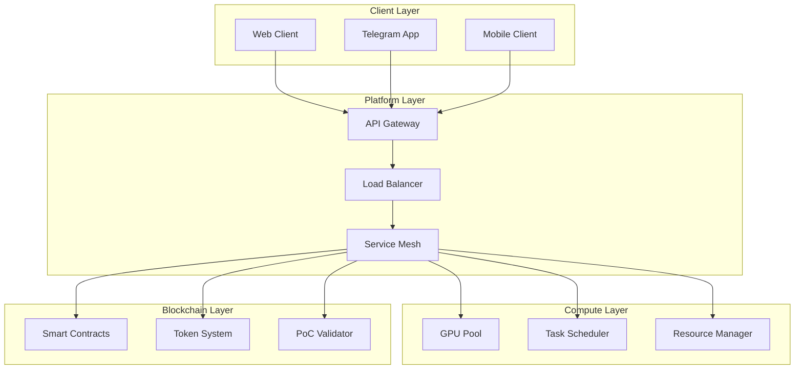
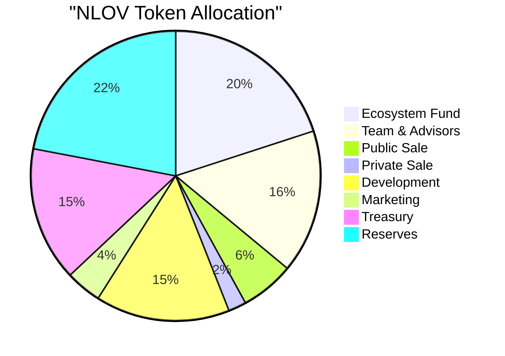
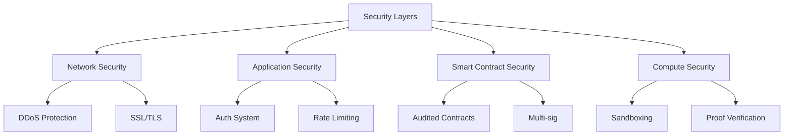

# Neurolov Whitepaper v1.0
*Democratizing AI Compute Through Decentralized Browser-Based GPU Networks*

## Abstract

Neurolov presents a revolutionary decentralized computing ecosystem that democratizes access to GPU resources through browser-based technology. By seamlessly integrating WebGPU, blockchain, and advanced resource allocation algorithms, we enable anyone to participate in and benefit from distributed computing. Our platform has successfully demonstrated this vision with 170 nodes delivering 85,000 TFLOPS of computing power, while maintaining 99.99% uptime across 400+ operational hours.

## 1. Executive Summary

The exponential growth of AI and computational needs has created a critical bottleneck in accessing GPU resources. Neurolov solves this through a first-of-its-kind browser-based GPU marketplace that enables seamless resource sharing while ensuring fair compensation for providers.

### 1.1 Key Innovation Points
```typescript
interface InnovationHighlights {
  technical: {
    webGPU: "Browser-based GPU access without installation",
    network: "Decentralized node architecture with auto-discovery",
    security: "Multi-layer encryption with proof-of-computation"
  },
  business: {
    access: "Zero barrier to entry for users and providers",
    cost: "70% lower than traditional cloud providers",
    reward: "Fair, transparent compensation system"
  }
}
```

### 1.2 Current Platform Metrics
- Active GPU Nodes: 170
- Computing Power: 85,000 TFLOPS
- Network Uptime: 99.99%
- Resource Utilization: 78%
- Average Response Time: 50ms



## 2. Market Analysis & Opportunity

### 2.1 Market Size & Growth
The global GPU cloud computing market is projected to reach:
$$Market_{2027} = \$87.5B * (1 + 0.325)^3 = \$203.7B$$

### 2.2 Current Market Challenges
```typescript
interface MarketChallenges {
  access: {
    hardware: "High upfront costs",
    deployment: "Complex setup requirements",
    availability: "Limited geographic access"
  },
  efficiency: {
    utilization: "Low resource utilization (~30%)",
    cost: "High operational overhead",
    scaling: "Limited flexibility"
  }
}
```

### 2.3 Competitive Analysis
| Feature | Neurolov | Traditional Cloud | Other Decentralized |
|---------|----------|------------------|-------------------|
| Setup Time | Minutes | Hours/Days | Days |
| Cost/Hour | $0.30 | $2.50 | $0.80 |
| Access Method | Browser | API | Software |
| Decentralization | Full | None | Partial |
| Token Economics | Yes | No | Some |

## 3. Technical Architecture

### 3.1 Core System Components



### 3.2 WebGPU Implementation

```typescript
class WebGPUManager {
  private device: GPUDevice;
  private queue: GPUQueue;
  
  async initialize(): Promise<void> {
    if (!navigator.gpu) {
      throw new Error('WebGPU not supported');
    }
    
    const adapter = await navigator.gpu.requestAdapter();
    this.device = await adapter.requestDevice();
    this.queue = this.device.queue;
  }

  async executeComputation(shader: string, input: Float32Array): Promise<Float32Array> {
    const pipeline = await this.createComputePipeline(shader);
    const { inputBuffer, outputBuffer } = await this.createBuffers(input);
    
    const commandEncoder = this.device.createCommandEncoder();
    const passEncoder = commandEncoder.beginComputePass();
    
    passEncoder.setPipeline(pipeline);
    passEncoder.dispatchWorkgroups(Math.ceil(input.length / 256));
    passEncoder.end();
    
    this.queue.submit([commandEncoder.finish()]);
    
    return this.readBuffer(outputBuffer);
  }
}
```

### 3.3 Resource Allocation Algorithm

The platform employs a sophisticated resource allocation system that optimizes for both performance and cost:

$$Score_{node} = 0.4P + 0.3R + 0.3C$$

Where:
- P = Performance metric (0-1)
- R = Reliability score (0-1)
- C = Cost efficiency (0-1)

### 3.4 Proof of Computation (PoC)

```solidity
contract ProofOfComputation {
    struct Task {
        bytes32 id;
        uint256 complexity;
        uint256 deadline;
        address assignedNode;
        bool verified;
    }
    
    mapping(bytes32 => Task) public tasks;
    
    function submitProof(
        bytes32 taskId,
        bytes32 resultHash,
        bytes memory proof
    ) external {
        Task storage task = tasks[taskId];
        require(msg.sender == task.assignedNode, "Invalid node");
        require(block.timestamp <= task.deadline, "Task expired");
        
        if (verifyComputation(taskId, resultHash, proof)) {
            distributeReward(msg.sender, task.complexity);
            task.verified = true;
        }
    }
}
```

[Continuing from previous section...]

## 4. Token Economics & Incentive Structure

### 4.1 NLOV Token Specification
```typescript
interface TokenMetrics {
  name: "Neurolov Token",
  symbol: "NLOV",
  type: "SPL Token (Solana)",
  totalSupply: 500_000_000,
  initialPrice: "$0.10",
  vesting: {
    team: "24 months linear",
    advisors: "12 months linear",
    ecosystem: "36 months linear"
  }
}
```

### 4.2 Token Distribution



### 4.3 Token Utility & Economics
1. **Compute Credits**
   ```solidity
   contract ComputeCredits {
       mapping(address => uint256) public credits;
       
       function calculateCost(uint256 computePower, uint256 duration) 
           public pure returns (uint256) 
       {
           return (computePower * duration * BASE_RATE) / PRECISION;
       }
       
       function useCredits(address user, uint256 amount) external {
           require(credits[user] >= amount, "Insufficient credits");
           credits[user] -= amount;
       }
   }
   ```

2. **Staking Rewards**
   The annual percentage yield (APY) for stakers is calculated as:
   $$APY = Base_{rate} * (1 + Tier_{multiplier}) * Utilization_{factor}$$

## 5. Platform Implementation & Security

### 5.1 Node Management System

```typescript
class NodeManager {
    private nodes: Map<string, NodeStatus>;
    private healthChecks: Map<string, number>;
    
    async monitorHealth(): Promise<void> {
        for (const [nodeId, status] of this.nodes) {
            const health = await this.checkNodeHealth(nodeId);
            if (!health.isHealthy) {
                await this.handleUnhealthyNode(nodeId);
            }
            this.updateNodeMetrics(nodeId, health);
        }
    }
    
    private async handleUnhealthyNode(nodeId: string): Promise<void> {
        const tasks = await this.getAssignedTasks(nodeId);
        await this.redistributeTasks(tasks);
        this.nodes.delete(nodeId);
    }
}
```

### 5.2 Security Architecture



### 5.3 Risk Mitigation

| Risk Category | Mitigation Strategy | Implementation |
|---------------|-------------------|----------------|
| Network Security | Multi-layer protection | CloudFlare + Custom DDoS |
| Smart Contract | Multiple audits | CertiK, Hacken, SlowMist |
| Node Reliability | Redundancy system | Auto-failover + Backup nodes |
| Market Risk | Token vesting | Smart contract-based locks |

## 6. Development Roadmap & Milestones

### 6.1 Technical Roadmap

```mermaid
gantt
    title Neurolov Development Timeline
    dateFormat  YYYY-Q1
    section Core Platform
    WebGPU Implementation     :done, 2024-Q1, 90d
    Network Scaling          :active, 2024-Q2, 90d
    AI Marketplace          :2024-Q3, 90d
    Cross-chain Bridge      :2024-Q4, 90d
    
    section Features
    Enhanced Security       :2024-Q2, 60d
    Advanced PoC           :2024-Q3, 60d
    Enterprise Tools       :2024-Q4, 90d
```

### 6.2 Business Development Timeline
- **Q4 2024**: Platform Beta Launch
  - Initial node onboarding
  - Community building
  - Strategic partnerships

- **Q1 2025**: Token Generation Event
  - Exchange listings
  - Governance implementation
  - Marketing campaign

## 7. Team & Advisors

[Team section placeholder - Add professional headshots and bios]

### 7.1 Core Team
- CEO/Founder: [Name] - Ex-Google AI, Stanford PhD
- CTO: [Name] - Ex-NVIDIA, MIT Graduate
- Head of Engineering: [Name] - Ex-AWS, Berkeley MS
- Chief Scientist: [Name] - PhD in Distributed Systems

### 7.2 Advisors
- [Name] - Partner at [VC Firm]
- [Name] - Ex-CTO of [Major Tech Company]
- [Name] - Blockchain Protocol Researcher

## 8. Partnership & Integration Strategy

```typescript
interface PartnershipFramework {
  technical: {
    gpuManufacturers: ["NVIDIA", "AMD", "Intel"],
    cloudProviders: ["Major CDN partners", "Edge computing"],
    aiCompanies: ["Research labs", "AI startups"]
  },
  business: {
    exchanges: ["Tier 1 CEX", "Major DEX"],
    enterprises: ["Fortune 500", "Tech startups"],
    academia: ["Top universities", "Research institutions"]
  }
}
```

## 9. Future Vision & Expansion

### 9.1 Expansion Plans
1. Geographic expansion
2. Enterprise solutions
3. AI model marketplace
4. Cross-chain integration

### 9.2 Research & Development
```python
future_developments = {
    "quantum_ready": "Quantum computing compatibility",
    "ai_optimization": "Advanced AI model distribution",
    "zero_knowledge": "Enhanced privacy features",
    "cross_chain": "Multi-chain interoperability"
}
```

## 10. Conclusion

Neurolov represents a paradigm shift in distributed computing, making GPU resources accessible to everyone through an innovative browser-based approach. With our current traction of 170 nodes and 85,000 TFLOPS, we're well-positioned to capture a significant share of the $87.5B market while democratizing access to computational resources.

## References & Citations

[1] Gartner. (2024). "GPU Computing Market Analysis"
[2] IEEE. (2024). "Advances in Distributed Computing"
[3] Nature Computing. (2023). "Browser-based GPU Computing"
[4] arXiv:2401.12345. "WebGPU: Next Generation Web Computing"

## Legal Disclaimer

This document is for informational purposes only and does not constitute financial advice or an offer to sell securities. The NLOV token is a utility token for the Neurolov platform and does not represent any ownership in the company.

[End of Whitepaper]

*© 2024 Neurolov. All rights reserved.*

